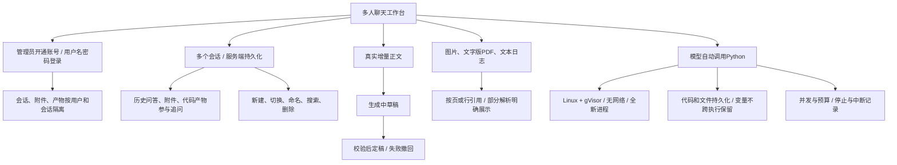

# 多用户聊天工作台规格

| 项目 | 内容 |
| --- | --- |
| 日期与版本 | 2026-10-04 / V1 |
| 需求状态 | Q1～Q22 及完整规格已于 2026-10-04 获用户确认，授权开始实现 |
| 实施状态 | WB-01～WB-08 已完成；综合证据见 WB-08 报告 |
| 技术方案 | [聊天工作台技术设计](chat-workbench-technical-design.md) |
| 任务入口 | [实施计划](hardware-operations-agent-implementation-plan.md#8-多用户聊天工作台) |
| 项目依据 | [原有技术设计](hardware-operations-agent-technical-design.md)、[术语表](../../CONTEXT.md) |

## 1. 交付目标

为现有 Go + Eino 硬件运维助手增加团队内网聊天入口，支持约 10 个同时活跃的会话。
用户使用管理员开通的账号登录，在多个独立会话内进行知识问答，上传图片、文字版
PDF 和文本日志，并让模型自动调用隔离的 Python 环境进行分析、绘图和生成文件。
换电脑登录、刷新页面和断线后仍能取得已保存的数据与处理状态。

视觉风格对齐 Claude（Q22）：暖白背景、低饱和配色、简洁侧栏、宽松排版和圆角输入区。
使用本项目的名称与文案，来源、执行记录和产物有清晰的展示入口。

## 2. 已确认的设计树

### 2.1 范围与访问

| 编号 | 已确认行为 |
| --- | --- |
| R01 / Q1、Q3、Q10 | 本期提供聊天、知识问答和沙箱代码执行；知识库管理和附件发布流程后续单独实现。 |
| R02 / Q2、Q5 | 管理员开通账号，用户名和密码登录。每个用户只能访问自己的会话、附件和执行产物。管理员身份本身不提供读取其他用户私有会话的权限。 |
| R03 / Q1、Q10 | 聊天附件只属于当前会话，本期不写入公共知识库。已发布公共资料继续可用于知识问答。 |
| R04 / Q11 | 部署为团队内网服务，以约 10 个同时活跃会话为本期容量验收目标；支持跨电脑访问同一账号数据。 |
| R05 / Q21 | React + TypeScript + Vite 构建前端，Go 同域托管；PostgreSQL 保存业务记录，持久化目录保存文件；独立 Linux + gVisor 沙箱执行 Python。 |

### 2.2 会话与持久化

| 编号 | 已确认行为 |
| --- | --- |
| R06 / Q9、Q17 | 会话支持新建、切换、自动命名、重命名、历史搜索和删除；消息按时间追加。 |
| R07 / Q9 | 模型可使用本会话历史问答、附件和代码产物；长对话按上下文预算压缩，原始记录保留。设备实时状态使用前重新获取。 |
| R08 / Q17 | 失败重试保留原记录，产生新的尝试并关联原响应；重复网络提交不会新增一次任务。 |
| R09 / Q19 | 同一会话逐条处理，不同会话可以并行；不能因多浏览器标签或重复请求绕过串行规则。 |
| R10 / Q20 | 删除会话先停止任务并立即禁止访问，再后台清理消息、附件和产物；首版不可恢复，删除前有明确确认提示。 |

### 2.3 流式输出与控制

| 编号 | 已确认行为 |
| --- | --- |
| R11 / Q8 | 使用真实模型增量输出，生成中显示为草稿；不能用完整结果的打字动画代替流式输出。 |
| R12 / Q8 | 完整输出经过引用与业务复核后定稿。校验失败撤回草稿并显示原因；草稿不能作为历史已确认答案重新展示。 |
| R13 / Q7、Q18 | 页面展示代码、运行输出和产物，提供停止按钮。停止取消本轮模型调用，终止运行中的 Python，并阻止本轮继续发起工具调用。 |
| R14 / Q18 | 浏览器断线时任务继续；重连按事件序号补齐，刷新可恢复当前状态。服务重启后未完成任务标记为中断，由用户重试，保留原执行记录。 |
| R14a / WB-10（2026-10-07） | 默认开启 DeepSeek 思考，在正文上方独立实时展示。生成时展开，完成后折叠，可手动切换；刷新恢复且不重复，停止/断流保留已收到的思考并标记中断。思考不作为正文、知识证据或历史摘要；模型未返回时不编造思考内容。 |

### 2.4 附件与证据

| 编号 | 已确认行为 |
| --- | --- |
| R15 / Q4 | 支持截图、设备照片、PDF 手册和文本日志；支持粘贴、拖拽上传和预览。 |
| R16 / Q14 | PDF 首版支持文字版，保留页码；其中的图片和表格按页处理。纯扫描 PDF 的整篇 OCR 不在本期。 |
| R17 / Q14 | 解析失败或仅部分页面处理成功时明确展示；答案不能把未成功处理的页面当作已读取。 |
| R18 / Q16 | 可以直接依据会话附件回答；引用标为“本会话附件”，可定位 PDF 页码或日志行号，图片引用可打开原图。代码计算结果关联实际执行记录。 |
| R19 / Q16 | 附件与公共知识冲突时，展示差异和双方来源；引用存在性校验不宣称证明语义正确。 |

### 2.5 Python 执行

| 编号 | 已确认行为 |
| --- | --- |
| R20 / Q6、Q7 | 首版支持 Python。模型按需自动分析日志、统计、绘图和生成结果文件；应用后端继续使用 Go + Eino。 |
| R21 / Q12 | 沙箱禁用网络；只能读取当前会话获授权的附件和产物，写入本次工作目录；使用预装包；不能访问宿主文件、服务凭据或其他会话。 |
| R22 / Q13 | 每次执行使用全新进程；代码与文件按会话持久化，Python 变量不跨执行保留。后续通过文件继续分析。 |
| R23 / Q21 | gVisor 等必需隔离能力不可用时明确拒绝执行；不回退到宿主 Python 或普通未验证隔离的执行环境。 |

## 3. 硬限制

以下是用户在 Q15、Q19 确认的初始上限。限制必须由服务端实施，前端提示不能替代校验。

| 项目 | 上限及计算口径 |
| --- | --- |
| 每条消息附件数 | 5；包含本条消息显式附带的已有文件引用 |
| 单个附件 | 50 MB，即 50,000,000 字节 |
| 每条消息附件总大小 | 100 MB，即 100,000,000 字节 |
| 单个 PDF | 200 页；不得静默截取前 200 页 |
| 单次 Python 执行 | 60 秒墙钟时间、1 CPU 配额、1 GiB 内存 |
| 全局 Python 并发 | 2；其余持久化排队 |
| 每轮 Python 次数 | 最多 3 次；失败和用户代码的自动修正重试也计数 |
| 每轮总预算 | 自消息受理起 5 分钟，包含排队、模型、工具和重试 |
| 容量目标 | 约 10 个同时活跃会话；不等于 10 个同时执行的 Python 进程 |

上传及附件解析在消息受理前完成，展示独立进度和失败状态；其执行仍需有独立的
超时、进程、内存和文件展开限制，不能成为无界后台任务。部分解析文件可显式
选择使用成功部分；所缺页面及原因随回答保留。超出上述硬限制直接拒绝。

## 4. 用户流程

### 4.1 首次登录与聊天

管理员创建账号，用户登录后进入自己的会话列表。新建会话、输入问题并发送，
消息立即持久化，页面按真实事件展示排队、检索和生成状态。模型正文增量出现在
“生成中草稿”区域；复核成功后替换为最终答案和可打开的来源。

同一会话已有未完成回复时，输入框保留草稿并提示当前任务；服务端拒绝新的冲突
提交，防止后发问题读取到尚未完成的上下文。用户可切换到其他会话继续工作。

### 4.2 文件分析

用户粘贴图片或上传附件，看到上传、解析、成功、部分成功或失败状态。用户可预览
图片、PDF 指定页和带行号的日志。模型只接收本会话授权的文件，并知道解析覆盖范围。

例如“统计这个日志中每小时的错误数并画图”：模型生成 Python，页面展示代码和
执行进度；成功后展示图表及下载入口。追问“把刚才的结果按错误类型分组”时，可
读取先前文件继续计算。代码输出提供计算过程的依据，不自动证明设备根因或恢复。

### 4.3 中断、停止和重试

关闭页面不取消服务器任务。重连复用原响应标识与事件游标，不重新发送问题。
用户点击停止后，当前响应进入取消流程，页面确认实际取消结果；已结束的执行
记录继续可查，尚未完成的输出标为不完整。

服务重启中断的响应保留故障原因和执行身份，清理或终止遗留沙箱后才开放对应的
新执行额度。用户重试会创建新的尝试，原任务不会被默默重跑。

### 4.4 删除

确认删除后，会话立即从正常列表移除，直接链接、事件连接、来源和文件下载均
不能继续访问。后台执行可重试的清理，删除失败需可观测，不能将记录删除成功
误当作文件已回收。取消后的迟到结果不得重新公开或使会话复活。

## 5. 页面结构

- 登录页：用户名、密码、明确的认证失败反馈。
- 主工作台：左侧会话及搜索，中间消息与输入区，按需展开来源和文件预览。
- 消息内容：安全渲染 Markdown、代码块、草稿标识、最终引用、缺口和失败原因。
- 执行卡片：代码、排队或运行状态、输出、耗时、退出结果及下载产物。
- 管理员账号入口：创建、停用账号及重置凭据；不开放他人私有聊天的阅读入口。

视觉对齐 Claude，仍以来源可核对、状态不混淆和长时间任务可控制为交互依据。
桌面浏览器为主要验收场景；窄屏折叠侧栏和预览，保证核心操作可用。

## 6. 明确留待后续的能力

知识库管理和发布流程、纯扫描 PDF 整篇 OCR、音视频输入、其他编程语言、联网代码、
运行时安装依赖、共享会话和协作编辑、编辑消息形成分支、持久 Python 内核、
诊断工作台及设备命令执行不属于本次交付。

现有公共知识检索继续复用。聊天私有文件不能混入公共检索索引，代码执行的授权
不能扩张成设备操作权限。已有原文、适用性、设备快照、LIVE/REPLAY 规则继续适用。

## 7. 验收矩阵

| 验收项 | 场景与可观察结果 | 主要工单 |
| --- | --- | --- |
| AC01 身份与隔离 | 两用户及管理员登录；替换会话、响应、文件、执行或事件 ID 均不能越权；管理员只能管理账号。 | WB-01 |
| AC02 持久化 | 新建、命名、切换、搜索、追加消息；刷新、换浏览器登录和服务重开后记录一致。 | WB-02 |
| AC03 多轮上下文 | 基于前轮附件和执行产物追问；跨会话不串用；长历史压缩后仍能追溯原记录。 | WB-02、WB-06 |
| AC04 真实流式 | 外部模型分多次发送正文，模型结束前浏览器已收到多个增量；工具参数和内部 JSON 不出现在正文。 | WB-05 |
| AC05 草稿复核 | 无效引用、资料撤回或设备更新触发草稿撤回；重连和重开不会重新呈现为已确认答案。 | WB-05 |
| AC06 附件 | 粘贴、拖拽、预览和定位来源；文字 PDF 图片及表格按页处理；扫描、超页、部分解析明确反馈。 | WB-04 |
| AC07 限制 | 文件数量与字节数、页数、执行时间、CPU、内存、调用次数、并发及总预算的边界和超限均被验证。 | WB-03～WB-06 |
| AC08 真实沙箱 | 实际 Linux + gVisor 运行 Python；网络、越权文件、宿主与凭据访问被阻止；隔离条件不符拒绝执行。 | WB-03 |
| AC09 分析闭环 | 上传日志 → 模型自动执行 → 图表与文件 → 追问使用产物；计算结果关联真实执行及输入。 | WB-06 |
| AC10 停止恢复 | 断线继续、重连不重复；停止终止实际进程；重启不重跑 Python；用户重试保留旧记录。 | WB-03、WB-05、WB-06 |
| AC11 删除 | 运行时删除会话，立即禁访并取消；后台清理可重试；迟到输出不复活已删除记录。 | WB-02、WB-04、WB-06 |
| AC12 界面 | Claude 风格、中文、桌面主要流程；键盘操作、长内容、空列表和错误状态可用。 | WB-07 |
| AC13 容量 | 10 个活跃会话，最多 2 个 Python 实际并发；队列有界，时限有效，报告成功、超时及排队分布。 | WB-08 |
| AC14 真实接入 | PostgreSQL、视觉、原生 tool-call、真实模型流式、Linux 沙箱分别报告结果；缺环境的项目不能标通过。 | WB-08 |

程序验收通过公开 HTTP 和浏览器流程，使用真实临时 PostgreSQL 与文件目录。
确定性外部模型桩结果标记 REPLAY；真实模型和实际隔离环境另行运行与报告。
用户提供的现场照片不是模拟监控数据，不能因模型模式为 LIVE 就标为实时设备观测。

## 8. 评审边界

上述产品决策来自已完成的访谈。技术设计中的字段名、运行参数补充及模块划分是
实现方案，已与本规格一同获用户确认；实现时可以优化内部组织，但不能改变已确认的
可见行为和硬限制。WB-01～WB-08 的实现与 AC01～AC14 结果见
[综合验收报告](../../reports/workbench-wb08-20261004/README.md)。
