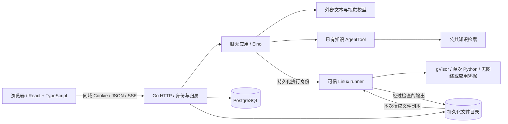

# 多用户聊天工作台技术设计

| 项目 | 内容 |
| --- | --- |
| 日期与版本 | 2026-10-04 / V1 |
| 状态 | 完整方案于 2026-10-04 获用户确认，已授权实施；本文不代表功能已经完成 |
| 行为契约 | [产品规格](chat-workbench-spec.md) |
| 原有约定 | [Go + Eino 技术设计](hardware-operations-agent-technical-design.md) |
| 实施顺序 | [WB-01～WB-08](hardware-operations-agent-implementation-plan.md#8-多用户聊天工作台) |

## 1. 现状与变更

现有实现提供会话创建、消息提交、响应读取和持久化 SSE；会话没有完整管理入口，
模型历史主要用于设备指代，尚未承载完整聊天历史。问答 SSE 当前主要推送状态和
完整答案，模型流适配仍需补齐真实增量处理。在线附件与聊天 Python 执行器需要新增。

本设计扩展现有问答应用，复用知识 AgentTool、适用性与引用校验，不另造一套 RAG。
问答当前在重启后重新运行图的做法，不适用于本次含 Python 执行的工作台；
工作台统一采用持久化执行身份和显式中断重试。

实施记录（2026-10-04）：WB-01～WB-04 已完成账号、归属、会话管理、有界历史、
模型取消、删除清理、重启中断、持久执行、私有附件及实际 Linux + gVisor 隔离解析；见
[WB-02 验收](../../reports/workbench-wb02-20261004/README.md)和
[WB-03 验收](../../reports/workbench-wb03-20261004/README.md)、
[WB-04 验收](../../reports/workbench-wb04-20261004/README.md)。
真实正文流及模型自动调用 Python 仍按 WB-05～WB-08 推进。

### 1.1 与原有接口的兼容

- 增加显式的 `local_token` 与 `users` 认证模式。原有单操作者 CLI、回放和验收可继续
  使用隔离的 `local_token` 部署；团队工作台使用 `users`，必须配置 PostgreSQL。
- `users` 模式拒绝旧共享 Bearer token；不能同时开一个绕过用户身份的旧入口。
  既有会话、响应、SSE、引用和执行读取路径均纳入身份与归属检查。
- 已发布公共知识允许登录用户读取；既有知识写入、设备登记等管理接口限管理员。
  尚未建立用户归属的旧诊断控制入口在 `users` 模式默认关闭，避免旁路访问。
- 历史 `local-operator` 私有记录必须通过显式迁移映射到一个指定账号。未映射记录
  不出现在任何用户历史中；不能默认公开，也不能让任意新注册身份自动认领。
- 账号迁移增加可追踪、可验证的数据库迁移版本；接入现有 001～004 时先核对已存在
  结构，异常即停止。禁止以丢表、重建业务库或自动覆盖现有数据完成升级。

## 2. 运行结构

前端构建产物由 Go 同域提供；团队部署通过 HTTPS 入口访问。数据库及持久化目录
挂载明确，应用重启或容器替换不丢数据。沙箱使用独立 Linux runner，runner 的控制
通信和文件传输与代码执行环境分离；gVisor 容器内没有调用业务系统的网络或凭据。

首期为一个应用实例、一个可信 runner，runner 上最多两个用户 Python 执行。
应用通过数据库锁限制同一工作台部署只有一个调度实例；不能启动多个实例各占
两个执行额度后仍声称满足全局并发限制。后续水平扩容另行设计。

## 3. Module 与 Interface

以下名称表达目标职责，不要求机械地新增同名包。`Module` 的 `Interface` 包括参数、
归属、顺序、预算、错误与恢复语义；`Adapter` 放在确实存在外部差异的 `Seam`。

| Module | 小范围 Interface | Implementation 内部职责 |
| --- | --- | --- |
| Identity | 登录、认证、管理账号与会话凭据 | 密码哈希、登录限制、会话撤销、管理员资格与可信 principal |
| Conversations | 提交、读取历史、管理会话、取消响应 | 归属检查、串行受理、幂等、历史选择、删除及执行协调 |
| Attachments | 接收、读取、获取证据 | 字节与类型检查、解析任务、页码及行号、私有文件授权、覆盖范围 |
| Execution | 启动、读取、取消一次执行 | 执行身份、队列、预算预留、runner 协议、输出检查与中断清理 |
| Answer delivery | 追加并读取有序响应事件 | 草稿版本、增量正文、重连、撤回与最终答案原子提交 |

应用传入可信的用户与会话作用域，模型只提交业务参数，如代码或文件 ID。
模型不能提供或覆盖 `owner_id`、宿主路径、挂载目录、镜像、运行权限、网络设置或配额。
不为每张表增加只有透传逻辑的独立 Module；归属和执行规则集中在调用者必须跨越的
Interface 内。PostgreSQL 与实际 runner 是生产实现，外部模型/runner 协议可用受控
外部桩验证失败路径；公开流程的业务存储使用真实临时库。

## 4. 身份与数据隔离

账号角色为 `ADMIN`、`USER`。管理员可创建、停用账号和重置凭据；账号管理不包含
读取他人聊天。首次管理员通过受控本地引导命令创建，不预置公共密码，不写入报告。
密码采用成熟的带盐慢哈希实现，登录失败信息不泄露账号存在性。

浏览器使用服务端会话凭据，Cookie 设置 HttpOnly、Secure 和适当的 SameSite；
改变状态的请求校验 Origin/CSRF。服务端保存凭据哈希、有效期和撤销状态；
退出、账号停用或凭据重置后撤销相关登录状态。密码和模型密钥不进入前端存储。

所有私有数据操作先认证，再同时检查用户、会话与对象归属。数据库读取与修改
直接包含归属条件，不能只在前端过滤列表。跨用户对象统一返回不泄露存在性的结果。
用户自己的其他会话附件也不能直接作为当前会话输入；需要将内容重新上传到当前会话。

同样的检查覆盖搜索、分页、SSE 续读、文件 Range 预览、下载、执行记录与缓存。
删除或停用导致已建立的流失效时关闭连接。私有响应和文件设置禁止共享缓存；
静态前端资源可以缓存，但持久化文件目录不能作为公开静态目录提供。

原有 Phoenix 等观测默认只记录工作台的标识、耗时、数量与错误；私有问题、文件、
代码和正文不得因沿用共享项目的调试导出设置而直接外发。测试用非敏感合成资料
单独验证明确开启的内容追踪，认证头与凭据始终不记录。

## 5. 数据与事务

| 记录 | 核心字段与约束 |
| --- | --- |
| users / auth_sessions | 用户名、角色、密码哈希、状态；会话凭据哈希、用户、过期及撤销时间 |
| conversations | owner_id、标题、标题来源、更新时间、状态版本、删除标记；已有设备上下文独立保留 |
| messages / responses | 用户问题、附件引用、有序序号、响应状态、最终答案、来源、retry_of、预算截止时间 |
| response_events | response_id、单调序号、事件类型、draft_version、负载、时间；每响应序号唯一 |
| attachments / attachment_pages | owner_id、conversation_id、原名、存储键、哈希、字节数、类型、页/行、解析覆盖及错误 |
| executions / artifacts | owner_id、conversation_id、response_id、执行身份、代码及哈希、输入清单、配额、状态、结果及文件哈希 |
| conversation_summaries | 会话、覆盖的消息序号范围、摘要、来源引用、生成状态与摘要版本 |
| cleanup_jobs | 删除对象、清理阶段、重试与错误；完成前保留可追踪的最小删除记录 |

附件原始内容和完成的产物使用不可变存储键。下载名称与存储路径分离；文件名不能
控制路径。已引用内容不原地覆盖，新的内容产生新文件身份。

提交消息时，在一个事务内检查会话归属、未删除、没有活跃回复、附件归属及限额，
分配序号、处理 `Idempotency-Key` 并写入响应与首个事件。同键同内容返回原响应；
同键不同内容返回 409。跨标签页的并发由数据库约束/行锁裁决。

同一会话已有活跃响应时，新提交返回可理解的 409，前端保留尚未发送的输入；
不会自动创建没有用户可见身份的第二条等待回复。显式失败重试使用新键、新响应，
保留 `retry_of`，共享的成功文件仍按原身份可追溯。

最终答案、终态和最终事件原子提交；保存前复核会话未删除、响应未取消、来源仍可用，
以及已有的知识发布状态、适用性和设备快照。不允许迟到生成覆盖取消或删除。

## 6. HTTP Interface 草案

路径在实施前锁定；以下为本设计的目标契约。未列出的旧私有读取路径也必须鉴权，
不能将迁移到新路径当作关闭旧入口的替代。

| 方法与路径 | 行为 |
| --- | --- |
| POST /v1/auth/login、POST /v1/auth/logout、GET /v1/auth/me | 登录、退出、读取当前身份 |
| POST /v1/admin/users、GET /v1/admin/users | 管理员创建与分页查看账号元数据 |
| PATCH /v1/admin/users/{id}、POST /v1/admin/users/{id}/password-reset | 停用或更新允许字段、重置凭据；不返回旧密码 |
| POST /v1/conversations、GET /v1/conversations | 创建与分页列出自己的会话 |
| GET /v1/conversations/{id}、PATCH /v1/conversations/{id} | 元数据与重命名，更新使用状态版本 |
| DELETE /v1/conversations/{id} | 原子标记删除并取消任务，202 返回清理已受理 |
| GET /v1/conversations/{id}/messages | 按稳定游标读取历史，包含响应引用和文件元数据 |
| GET /v1/conversations/search?q=... | 自己的标题、用户问题和最终答案搜索；分页且查询有界 |
| POST /v1/conversations/{id}/messages | text、attachment_ids、必要设备选择；202；幂等与串行约束 |
| GET /v1/responses/{id}、GET /v1/responses/{id}/events | 最终/当前状态和可续读事件 |
| POST /v1/responses/{id}/cancel | 幂等取消本轮，返回已受理或已有终态 |
| POST /v1/conversations/{id}/attachments | multipart 上传并异步解析，返回附件与处理标识 |
| GET /v1/attachments/{id}、GET /v1/attachments/{id}/content | 状态及覆盖范围、授权原文件/Range 读取 |
| GET /v1/attachments/{id}/pages/{page} | 该页预览、文本、图片/表格证据和解析状态 |
| GET /v1/executions/{id} | 代码、输入、输出、错误、配额与产物引用 |
| GET /v1/artifacts/{id}/content | 授权读取已接收的产物，按类型预览或下载 |

一条消息可以只有附件或只有文字，但两者不能同时为空。前端发送模型请求和执行
控制均经 Go，不能拿模型密钥或直接连接 runner。

## 7. 多轮上下文

持久化记录是权威历史，模型上下文是有界选择。保留当前问题、最近完整轮次、
较早轮次摘要和可用文件清单；记录选择的消息范围、摘要版本及实际载入的来源。
摘要不能丢弃或改写引用身份，不能把草稿、未完成执行或未读取页面变成已确认事实。

模型可通过会话附件读取工具取得具体页/行和产物，工具强制归属、大小及来源检查。
大附件按页/片段检索，仅在当前会话的私有数据内进行；不为此向公共 ES 索引发布。
文件清单不能无限直接塞入模型，检索与上下文都计入明确预算。

新增工具后同步核对 Eino 图步数、各工具调用上限和模型次数预算；不能直接沿用旧图
十二步上限而提前拒绝合法分析，也不能移除循环上限。摘要、模型重试和回答修正
计入本轮模型与时间预算；附件读取同样采用有界次数、页数和字节量。

压缩失败时保留原始历史，明确报告本轮上下文限制；不能伪称已记住被省略内容。
可配置上下文上限在调用前核对模型能力；无法满足时明确失败或返回具体缺口，
不依赖上游静默截断。历史设备读数不能替代本轮需要的新鲜观测。

## 8. 真实流式正文

模型 Adapter 实现上游真实流读取，包括内容增量、原生工具调用参数分片、
结束原因及真实 usage。`Stream()` 不再以等待 `Generate()` 完成为实现。

现有最终回答采用结构化 claims。使用有界的增量结构解析器，只提取可见正文对应
的字符串片段，如 `claims[].text`；正确处理 JSON 转义、Unicode 和跨帧分片。
工具名称/参数、内部 JSON 结构、分析字段与模型内部推理不作为聊天正文发布。
工具调用只有完整组装并校验后才执行，不能边收到部分参数边运行代码。

2026-10-07，WB-09 补充会话回复 `reply:{kind,text}`，用于身份与能力介绍
（`INTRODUCTION`）、问候（`GREETING`）及需求澄清（`CLARIFICATION`）。
它不要求知识引用，不能与 `claims`、`observations`、`conflicts` 混用；
身份和问候不调用工具且不附带缺口。正文必须非空、最多16000字节。
硬件事实、操作建议、实时读数和附件/执行结论继续采用原有证据字段与检查。
回复用途的语义正确性由模型遵循提示，类型和混用检查不等于证明自然语言正确。

流式解析同时提取直接根路径 `reply.text`，仍按可撤回草稿处理；最终
`Response.reply` 与 `answer` 一起持久化。介绍和问候为 `ANSWERED`，
澄清为 `NEEDS_CLARIFICATION`。历史上下文保留已保存的回复正文，使短追问
可以接续上一轮介绍或澄清；失败、取消和未定稿草稿不会成为历史答案。

草稿事件必须在模型完成前实际发出。可用小批次将正文事件持久化后推送，批次以
时间/字节阈值限制，不等待整个答案。浏览器安全渲染正文，代码只是展示文字，
网页不能执行模型生成的 HTML 或脚本。

2026-10-07，WB-10 按用户要求默认开启 `deepseek-*` 的
`thinking.type=enabled`。Adapter 从原生流和 buffered completion 读取
`reasoning_content`，保留在 Eino assistant 消息内，并在本轮工具循环完整回传。
思考与正文、工具参数共同计入单次模型响应 1 MiB 上限；仅有思考不算有效完成。
其他模型不附加 DeepSeek 专属参数；模型不返回思考时页面不构造思考文本。

主回答图以独立 emitter 持久化思考；检索改写、证据选择和摘要的内部调用不进入
页面思考区。`Response.reasoning={text,status,event_id}` 保存累计文本和最新游标；
每条增量最多 16 KiB，每个回复累计最多 512 KiB，超限明确失败。
思考首次转入正文/完整工具调用或正常结束时标为 `COMPLETED`；
下一次主模型调用产生思考时追加空行并恢复 `RUNNING`。
仍在思考时发生失败、取消或重启则标为 `INTERRUPTED`，保留已有文本。
已完成的思考段不因后续回答校验失败而重新标成未完成。

思考快照与 `reasoning_delta` / `reasoning_done` 事件在同一事务内更新，
沿用 conversation→response 锁顺序、归属检查及 RUNNING 写入限制。
最终 worker 保存必须合并数据库最新思考，不能用旧响应覆盖它。
前端按 `reasoning.event_id` 合并快照与重放事件，避免刷新或并发请求导致重复追加。
思考区放在正文上方，生成时默认展开、完成时折叠，允许手动切换，使用安全
Markdown；思考不成为已校验答案、引用、会话检索、模型历史或摘要，追踪导出也移除该字段。

| 事件 | 含义 |
| --- | --- |
| accepted / progress | 已受理与真实处理阶段 |
| draft_started / answer_delta | 新草稿版本与正文增量 |
| reasoning_delta / reasoning_done | 独立思考增量及完成/中断状态，带 reasoning_status |
| tool_progress | 可信执行记录的状态、输出及产物引用 |
| draft_retracted | 指定草稿版本失效；前端立即移除其正文和临时引用 |
| answer | 已持久化、已校验的最终 Response |
| failed / canceled / interrupted | 明确终态；不提升已有草稿为最终答案 |

每事件有稳定 ID，游标绑定当前响应。客户端重放后与直接读取当前状态得到一致视图；
旧草稿增量不能在撤回后复活。断线只关闭订阅，客户端用游标续读，不重发消息。
草稿修正或生成重试增加 `draft_version`，先撤回旧版本再开始新版本。

最终复核继续覆盖完整结构、真实来源、知识发布状态、适用性、设备快照及冲突，
扩展支持附件和执行来源。一次允许的输出修正仍在同一总预算内。引用或最终保存
失败时撤回草稿；历史搜索、摘要和默认历史接口只使用最终答案及明确的失败记录。
这一变更见 [ADR-0001](../adr/0001-provisional-streaming-answers.md)。

## 9. 附件处理与来源

按流读取上传内容并检查真实字节数，不信任 Content-Length、扩展名或 MIME 声明。
原始文件写入隔离的暂存位置，完整性与限额校验后才成为可引用附件；未完成上传
定期回收。前端限制、每文件限制和消息引用总量在各自阶段重复核对。

首期文件类型为常见静态图片（PNG/JPEG/WebP）、PDF、UTF-8 文本日志。
文本型结构化日志仍按文本和行号提供；其他二进制格式明确拒绝。

- 图片：保留原文件，实际图片字节进入视觉模型；记录尺寸、可见内容与读取限制。
  页面和模型不能直接追随用户文件中包含的外部 URL。
- 文字 PDF：保存原始页序，提取逐页文本、表格和内嵌图片；有界渲染供预览及视觉
  处理。纯扫描文件明确为本期不支持，混合文档的不可处理页标明缺口。
  文档中的图片可做视觉理解，这不等于承诺整篇扫描 OCR。
- 日志：保留稳定的原始行号和内容哈希；展示/引用不因模型预处理改变原文位置。

解析状态为 `UPLOADED → PROCESSING → READY | PARTIAL | FAILED | UNSUPPORTED`。
逐页结果记录成功/失败和原因，限制图片展开尺寸、页渲染资源和总输出，避免小文件
解压或渲染成无界输入。解析执行使用隔离、固定版本的可信处理程序；故障不能影响
HTTP 主进程，也不能与用户代码共用一个存活的解释器。

视觉与文本工具返回带类型的 SourceRef：

| source_kind | 最少可核对信息 |
| --- | --- |
| KNOWLEDGE | 既有 revision/fragment、原文范围及哈希、适用性 |
| ATTACHMENT | 当前会话附件 ID、内容哈希、页码或行范围、解析覆盖 |
| EXECUTION | 执行 ID、完成状态、代码及输入哈希、所引用的输出/产物及哈希 |

新来源允许“只有私有附件、没有公共知识”的问答，但绝不能伪装成已发布手册。
图片解释保留不确定性；执行成功证明代码实际运行，不证明模型的分析方法正确。
附件、代码输出和历史文字均作为数据处理，不能授予模型新的工具或访问权限。

## 10. Python 执行与产物

### 10.1 执行身份与状态

每次调用先在 PostgreSQL 预留调用次数与执行身份，再向 runner 发起请求。
执行记录固定 owner、会话、响应、代码哈希、输入 manifest、镜像摘要和资源设置。
runner 用执行 ID 幂等受理：重复请求返回同一次执行，内容不同拒绝。不能只用代码
哈希去重，因为用户显式重试可以合法执行相同代码。

状态为 `QUEUED → STARTING → RUNNING → SUCCEEDED | FAILED | CANCELED | INTERRUPTED`，
取消过程可处于 `CANCELING`。文件接收与进程退出结果可核对后才提交 SUCCEEDED。
网络超时或进程状态未知不能伪造成功、取消成功或自动重跑。

全局最多两次用户 Python 执行；排队、失败、自动修正均受每轮三次与五分钟预算。
runner 的硬限制独立于应用进程存活：单次 60 秒、1 CPU、1 GiB，且限制进程数、
临时磁盘和输出。全局模型并发单独设置，不能用放大模型并发绕过执行限制。

### 10.2 隔离与文件授权

runner 显式使用 gVisor 运行时；启动及执行前检查运行时、资源限制与文件配置。
配置或探测不通过返回可理解的错误，不降级。可信控制进程只接受来自应用的受控
请求，运行代码所在容器无控制平面凭据，无 Docker socket，无宿主业务目录。

每次使用全新容器/进程、非 root 用户、只读基础镜像、最小权限与无网络设置。
输入采用本次授权文件副本或只读挂载到固定位置，产物写入有配额的临时输出目录。
前轮产物需经归属校验后才能再次成为只读输入。数据库连接、模型密钥和认证信息
不传给用户代码；基础镜像按内容摘要固定。

首批预装包建议包含 pandas、numpy、matplotlib、Pillow，版本在实现时锁定并验证。
离线执行不提供 pip 安装；缺包时明确报告。图表可返回 PNG 等静态产物。
PDF 可信解析镜像和用户 Python 镜像分开维护，不向用户代码暴露解析控制权限。

### 10.3 输出与取消

记录代码、stdout/stderr、退出码、实际耗时、输入来源和产物清单。接收产物时验证
归属、大小、类型及路径，拒绝路径穿越、符号链接、硬链接等越界导出方式。
只从本次输出目录收取文件，并在完成检查后生成不可变产物 ID。

取消先持久化意图，停止后续调度，取消模型请求，再要求 runner 终止整个执行组。
runner 确认退出和回收后结束取消；失联时保留未完成状态，不能释放额度后留下
孤儿进程无限运行。硬时限仍在 runner 生效；恢复时按执行身份核对并回收遗留任务。

已完成并接收的产物继续留在原执行记录；中断输出标为不完整，不作为成功计算
依据。服务重启将未完成工作台响应标为中断，用户重试创建新尝试。
不能复用现有“重启后重新运行整个问答图”的实现。见
[ADR-0002](../adr/0002-isolated-durable-python-execution.md)。

## 11. 删除与清理

删除事务写入会话删除标记、取消意图和清理任务，立即使所有私有读取、搜索、
SSE 与文件访问失败。清理任务依次核对终止执行、回收暂存和产物、删除相关数据。
操作按对象身份幂等，不依赖目录名来自用户输入。

清理失败保留最小 tombstone 和重试信息；迟到的模型与 runner 结果只参与清理，
不重新开放数据。删除的会话不可恢复。该承诺针对应用主存储；部署备份的生命周期
在运维说明中明确，不把删除主目录描述为已经擦除所有历史备份。

## 12. 工程默认值与待验证事实

这些是实现参数初值，不替代产品规格中的已确认硬限制。实施工单需要记录最终
配置和理由，所有截断或达到限制的情况都应可观察。

| 项目 | 实现初值/验证要求 |
| --- | --- |
| 文件解析 | 单文件解析任务最多 5 分钟；独立有界队列，与聊天五分钟预算分开计时 |
| 执行输出 | stdout/stderr 合计最多 1 MiB；最多 20 个产物，合计 100 MB，超限终止并标明原因 |
| 执行临时目录 | 每次最多 256 MiB 可写空间；进程数上限 64；输入文件只读且不计为新增输出 |
| 模型上下文 | 显式配置低于真实模型上限的预算；必须验证计数/估算及超限反馈，不默认无限历史 |
| 队列与磁盘 | 部署显式配置队列容量、总文件存储额度与保留空间；耗尽返回资源不足，不继续受理无界任务 |
| 沙箱能力 | Linux + gVisor、CPU/内存/时间/进程/文件/网络限制逐项用真实任务验证 |
| 模型能力 | 原生工具、真实 stream、图片字节读取分别烟测；任一缺失不得用固定内容代替成功 |

WB-03 已在专用 ARM64 Linux 6.8 VM、Docker cgroup v2 和 gVisor 20260928.0 中
验证 Python 镜像、隔离、资源限制、取消与回收；工作台 PostgreSQL 17.11 也已实际
接入。该结果不替代目标团队 Linux 主机的部署复验，协议桩仍不能填补实际隔离结果。
视觉、原生流和模型自动 Python 工具调用分别由 WB-04～WB-06 验收。

## 13. 验证与交付

从浏览器和公开 HTTP 验证完整用户行为，使用真实临时 PostgreSQL、真实附件目录和
外部模型 Adapter。加入两用户互换 ID、管理员权限、并发提交、事件重放、草稿撤回、
删除与迟到回调、执行幂等及预算用尽的反例。多模态验证实际图片内容和 PDF 页码，
不能以模型声称“看到了图片”作为唯一证据。

在 Linux 上实际执行网络/文件越权、资源超限、停止、进程回收及运行时不可用场景，
再运行日志统计与绘图正例。测试代码、输入和输出留存用于复核，不能在宿主直接
运行不可信用户代码来代替沙箱测试。

容量验收运行 10 个活跃会话，记录模型首增量、排队时间、端到端耗时、失败和超时，
并从真实执行记录证明 Python 并发从未超过 2。确定性 REPLAY 容量与真实模型小样本
分别报告；没有足够模型容量不能宣称完成真实模型并发验收。

前端进行类型检查、构建及关键浏览器流程验证；后端按变更运行公开验收、race、
vet 和构建。保留原有 QA 与诊断回归，确认认证模式区分不破坏已有单操作者演示。
