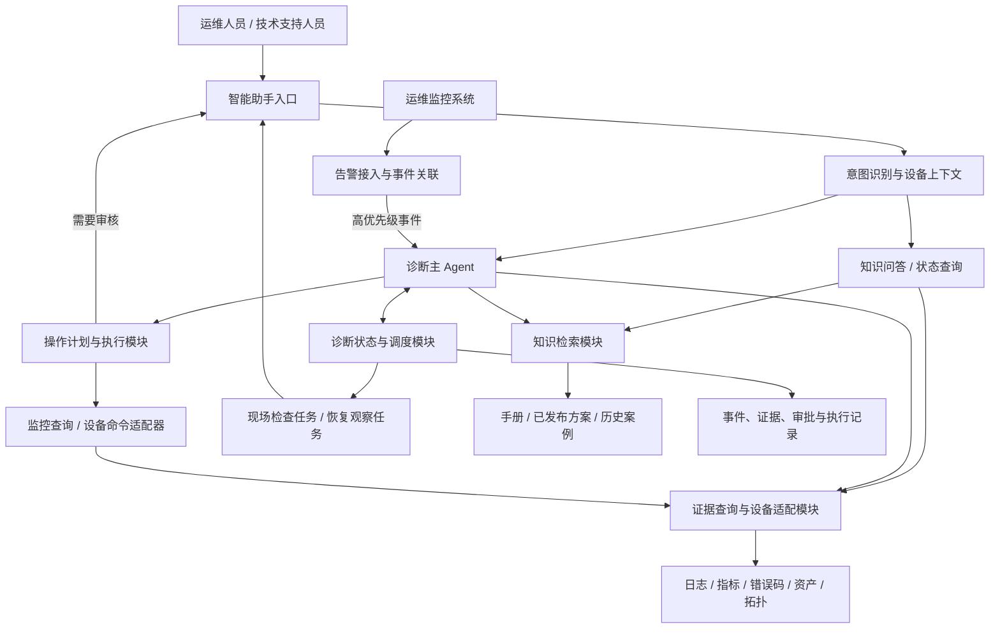
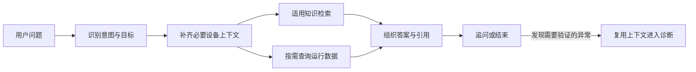
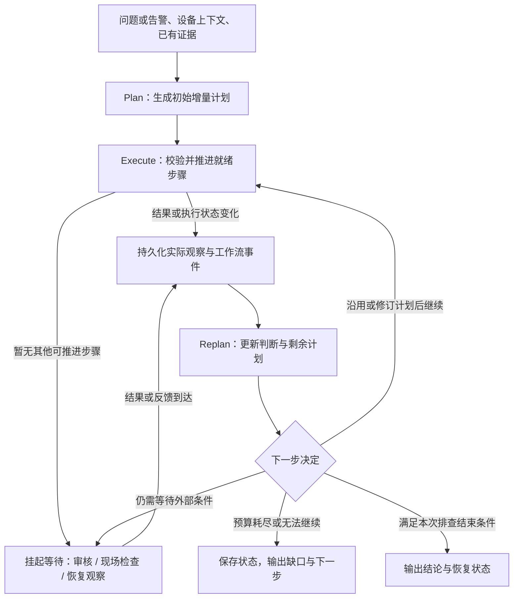
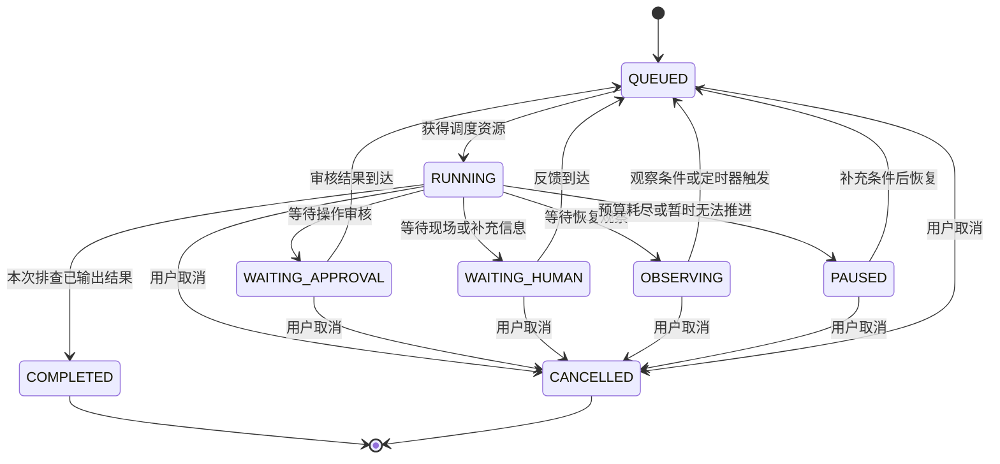
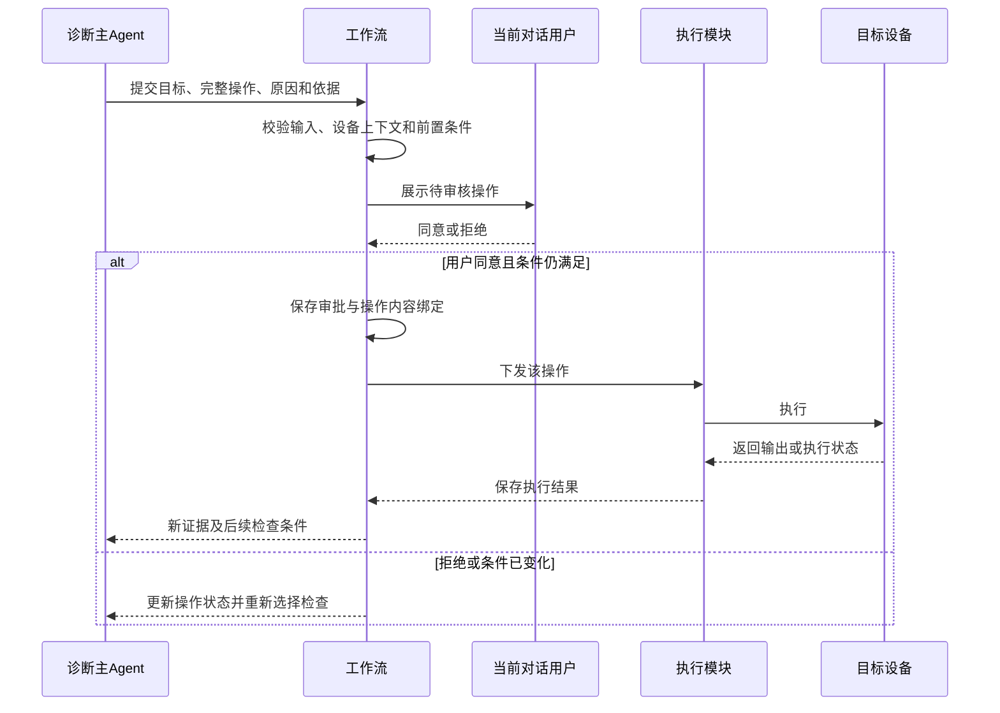

# 算力中心硬件运维智能助手总体设计

| 项目 | 内容 |
| --- | --- |
| 文档版本 | V1.1 |
| 编写日期 | 2026-09-19 |
| 适用场景 | 华为超节点算力中心的交换机、服务器、算力卡及相关硬件设施运维 |
| 目标用户 | 运维人员、技术支持人员 |
| 设计规模 | 十万卡级别，包含其配套服务器、交换机、链路等设备 |
| 部署方向 | 算力中心内网部署，设备工具在内网执行，模型通过统一接口接入 |
| 实现技术栈 | 整体应用使用 Go，Agent 与流程编排使用 CloudWeGo Eino |
| 方案依据 | 已确认的需求与总体方案；本文将其细化为模块、流程、数据约定和验收计划 |
| 容量说明 | 128 个活跃诊断任务为初始设计值，支持扩至 256 个；模型资源与实际吞吐需通过压测确定 |
| 配套文档 | [技术设计](hardware-operations-agent-technical-design.md)：实现默认值与接口约定；[实施任务](hardware-operations-agent-implementation-plan.md)：交付顺序、依赖和验收条件 |

## 1. 背景与目标

算力中心的运维监控系统持续产生交换机、服务器和算力卡的故障告警。故障信息分散在设备日志、遥测指标、错误码、维修手册、资产与拓扑记录、历史工单中。不同设备型号及固件、驱动版本的诊断方式存在差异，部分故障还需要现场观察或测量才能确认。

建设统一的硬件运维智能助手，让运维人员通过对话完成知识咨询、运行状态查询、告警解释、故障诊断、配置指导和经审核的操作执行。对于高优先级告警，系统自动开展只读排查，提前形成证据与候选原因。

核心目标包括：

1. **回答有依据。** 运维建议能够追溯到适用的手册、方案、运行数据或已确认案例。
2. **诊断能推进。** 根据已有证据选择下一项检查，持续确认或排除候选原因。
3. **适配多型号、多版本。** 通用流程复用，设备差异通过知识适用范围和能力适配处理。
4. **支持人机协作。** 现场检查、命令审核和恢复观察可以中断、交接、继续。
5. **结论可核对。** 根因状态由证据决定；故障恢复与根因确认分别记录。
6. **控制排查成本。** 使用事件归并、查询复用、并发限制和排查预算支撑十万卡场景。

本文定义通用设计。具体设备命令、监控接口、错误码规则和版本兼容关系，在设备接入时依据实际资料补齐。

## 2. 业务范围与已确认决策

### 2.1 场景范围

| 场景 | 用户问题或触发方式 | 主要处理 | 结果 |
| --- | --- | --- | --- |
| 运维知识问答 | 指示灯含义、错误码解释、故障处理方法 | 识别适用设备，召回知识，组织答案 | 解释、处理建议、适用条件、引用 |
| 配置指导 | 某设备的某项配置应该怎样设置 | 获取型号版本，检索对应配置说明 | 配置方法、前置条件、依据 |
| 运行状态查询 | 某设备目前运行状况如何 | 查询当前告警、关键指标及必要日志 | 状态摘要、数据时间、异常和数据缺口 |
| 告警解释与诊断 | 某告警是什么原因、如何处理 | 建立故障上下文，逐步验证候选原因 | 根因判断、证据、已排除原因、下一步 |
| 主动排查 | 高优先级告警触发 | 事件关联、只读证据采集、候选原因分析 | 可继续处理的诊断记录 |
| 现场协作 | 风扇状态检查、光模块清洁或检查等 | 生成现场任务，接收观察和测量结果 | 现场证据与后续诊断 |
| 操作执行 | 用户同意执行诊断或处理命令 | 审核具体操作，执行并核对结果 | 执行记录、结果、后续验证 |

配置指导首先生成答案或操作建议。实际执行配置变更时，进入操作审核流程。

### 2.2 已确认决策

| 决策 | 设计约定 |
| --- | --- |
| 开发语言与框架 | Go + CloudWeGo Eino，覆盖问答、持续诊断、工具适配和回放评测 |
| 支持范围 | 不绑定单一型号，覆盖多类设备及其多个版本 |
| 知识未匹配 | 优先检查和调整召回方式；仍未匹配时明确缺口，继续不依赖特定版本的检查 |
| 知识维护 | 运维专家维护适用范围、发布状态、来源和修订记录 |
| 历史案例 | 用于提供候选原因，经复核后才沉淀为正式排障方案 |
| 跨设备排查 | 从目标设备出发，根据证据沿拓扑扩展 |
| 自动触发 | 高优先级告警自动触发只读排查 |
| 自主检查 | Agent 可调整检查顺序、复用有效证据、组合适用方案；保留必要前置条件 |
| 动态 CLI | 允许临时生成并执行从手册等依据推导的命令，执行前需要审核同意 |
| 审核人员 | 当前对话发起用户审核该对话提出的操作 |
| 操作说明 | 展示操作原因和手册出处（如果有），并展示目标设备及完整命令 |
| 事件组织 | 同一故障事件复用记录；跨设备关联需验证共同原因；恢复后再发建立新事件 |
| 排查结束条件 | 受时间、查询次数和扩展范围等预算控制；无有效新证据时输出缺口 |
| 现场协作 | 持久化任务和观察结果，支持跨人、跨班次恢复 |
| 结果不明 | 状态变更超时后先查询实际状态，再决定下一步 |
| 恢复判断 | 检查告警、指标、必要功能测试和观察窗口，与根因确认分开记录 |
| 业务影响信息 | 首版审批内容聚焦操作原因和依据，任务调度及业务影响分析不作为接入前提 |
| 首批验收 | 先覆盖普通问答，再覆盖明确错误码、拓扑关联、现场协作三类诊断路径 |

## 3. 总体架构

采用“诊断主 Agent + 可恢复工作流 + 共享知识、证据和执行能力”的组织方式。每个故障事件由一个主 Agent 推进，不同事件通过调度模块并发运行。

应用代码采用 Go，问答及主诊断流程由 Eino `compose.Graph` 编排，线性子流程可使用 `compose.Chain`。Eino 提供模型、检索与工具接口；Go 业务模块负责设备适用性、计划版本、审核和执行约束。具体映射见配套技术设计。

主 Agent 负责理解问题、维护候选原因、选择检查和解释结果。工作流负责持久化进度、落实前置条件、审批、预算和执行状态。不同检查可以并行，但它们共享同一事件的结构化证据与结论。

### 3.1 逻辑架构



这些是逻辑模块，可以按负载和部署条件组合部署。模型、设备类型和监控系统的差异通过适配器隔离。

### 3.2 模块职责

| 模块 | 输入 | 核心职责 | 输出 |
| --- | --- | --- | --- |
| 会话与事件接入 | 用户问题、告警、已有事件引用 | 识别意图和目标，关联事件，安排处理路径 | 请求上下文、事件标识、任务类型 |
| 知识检索 | 问题、错误码、设备身份、版本、检索历史 | 适用性筛选、混合召回、重排、检索纠偏、冲突识别 | 知识片段、出处、适用性、缺口 |
| 证据查询与设备适配 | 目标设备、时间窗口、查询目的 | 映射设备标识，调用监控与设备接口，整理证据和拓扑 | 结构化观察、原始内容引用、获取状态 |
| 诊断推进 | 事件、知识、证据、历史动作、剩余预算 | 更新候选原因，选择检查，提出操作，判断确认条件 | 检查计划、操作建议、诊断结果 |
| 操作执行 | 具体操作、审核结果、执行上下文 | 校验目标与前置条件，执行，核对返回与不确定结果 | 执行状态、输出、可供诊断的新证据 |
| 状态与调度 | 事件变化、任务、审批、人工反馈、定时器 | 保存和恢复进度，管理并发、租约、等待状态与预算 | 可运行任务、状态快照、事件历史 |

模块接口应返回业务上完整的结果。例如，证据查询同时返回观察值、时间、来源和获取状态，避免让每个调用方各自判断空值、超时和过期数据。

### 3.3 模型与工作流的分工

| 模型负责 | 工作流和程序负责 |
| --- | --- |
| 理解自然语言、识别诊断意图 | 设备唯一标识解析及歧义检查 |
| 生成检索查询和候选原因 | 版本适用性、引用存在性和结构化输出校验 |
| 根据证据选择下一项检查 | 前置条件、预算、去重和并发限制 |
| 生成待审核 CLI 与操作说明 | 将审批绑定到具体目标和命令 |
| 归纳证据、解释判断 | 持久化证据、动作、结果与状态迁移 |
| 提议根因状态变化 | 检查确认条件及其引用证据是否满足 |

文档、日志、工单和命令输出作为诊断资料处理。执行模块只接受经结构化校验、满足执行条件的操作计划。

## 4. 数据基础与核心对象

### 4.1 数据来源

| 数据 | 主要用途 | 关键要求 |
| --- | --- | --- |
| 资产清单 | 确定目标设备与部件 | 设备唯一标识、型号、硬件修订、槽位、端口等映射 |
| 固件、驱动和管理软件版本 | 匹配知识与工具能力 | 记录版本查询时间，支持多个版本维度 |
| 告警和错误码 | 触发事件、识别症状 | 原始告警标识、来源、发生与恢复时间、严重级别 |
| 日志 | 重建故障前后过程 | 时间范围、设备归属、日志位置、时间基准 |
| 遥测指标 | 观察趋势、异常与恢复 | 单位、采样时间、聚合方式、缺失状态 |
| 物理与逻辑拓扑 | 查找共同依赖和关联设备 | 关系类型、端点、有效时间、数据来源 |
| 配置与近期维护记录 | 解释故障前后的变化 | 变更对象、时间、前后差异及记录来源 |
| 手册与正式方案 | 提供适用知识和诊断步骤 | 来源、适用范围、修订版本、发布状态 |
| 历史工单 | 提供候选原因和经验 | 症状、诊断过程、最终根因、维修结论、时间 |
| 现场反馈 | 验证远程无法确认的现象 | 目标位置、操作者、观察时间、文字或附件、测量单位 |

优先通过已有监控系统查询运行数据。原始日志和遥测可保留在现有系统中，助手保存必要的证据片段或可稳定定位的引用。上游数据可能过期时，按保留策略固化支撑诊断的内容。

### 4.2 核心对象

| 对象 | 主要字段 | 作用 |
| --- | --- | --- |
| 设备快照 `DeviceSnapshot` | 设备标识、型号、部件位置、版本集合、采集时间、拓扑快照引用 | 固定本轮诊断的设备上下文 |
| 故障事件 `Incident` | 事件标识、目标集合、故障时间范围、原始告警、关联关系、根因状态、恢复状态 | 聚合一次故障及其生命周期 |
| 诊断运行 `DiagnosticRun` | 运行标识、事件标识、触发方式、状态、当前阶段、计划引用及版本、剩余预算、状态版本 | 保存一次自动排查及其暂停、恢复过程 |
| 诊断计划 `DiagnosticPlan` | 计划标识、版本、设备上下文引用、候选原因引用、检查步骤、结束条件、修订原因 | 保存 Plan 生成和 Replan 更新的增量计划 |
| 计划步骤 `PlanStep` | 步骤标识、目标、检查目的、依赖、前置条件、预期观察、动作引用、状态、结果引用 | 表达一项可追踪的检查及其执行进度 |
| 知识条目 `KnowledgeItem` | 文档标识、修订版本、适用范围、章节、片段、来源、发布状态 | 提供可引用且适用的运维知识 |
| 检索尝试 `RetrievalAttempt` | 查询、筛选条件、检索方式、候选结果、未选原因、轮次 | 支持检索纠偏和问题分析 |
| 证据 `Evidence` | 设备与部件、观察时间、获取时间、观察值、单位、来源、获取状态、原始引用 | 支撑或反对候选原因 |
| 候选原因 `Hypothesis` | 原因描述、支持证据、反对证据、缺失检查、确认条件、状态 | 显式维护诊断判断 |
| 操作 `Action` | 操作标识、目标、工具或完整命令、参数、原因、知识引用、前置条件、状态 | 表达准备执行的具体检查或变更 |
| 审批 `Approval` | 操作标识及内容摘要、对话标识、审核用户、决定、时间、适用上下文 | 将用户同意绑定到明确操作 |
| 执行结果 `ExecutionResult` | 操作标识、下发时间、执行状态、退出信息、输出引用、实际状态查询结果 | 区分成功、失败和结果不明 |
| 人工任务 `HumanTask` | 事件、目标位置、检查方法、预期观察、停止条件、反馈、任务状态 | 支持现场检查与交接 |

证据的获取状态至少区分：成功获得、明确无记录、查询失败、数据过期、无可用能力。明确无记录是否有诊断意义，由查询覆盖范围和相应确认条件决定。

### 4.3 时间与标识对齐

统一记录故障发生时间、数据观察时间、系统获取时间和文档发布时间。运行状态查询以当前状态为目标，故障诊断以故障时间窗口为基础，并明确后续查询反映的时间。

设备昵称、管理地址、监控对象、服务器标识和算力卡槽位需要映射到可区分的设备或部件。目标存在歧义时先澄清，避免把其他设备的数据用于当前事件。

设备版本或配置发生变化后，重新检查已有证据和操作计划的适用性。查询复用需要同时考虑目标、时间窗口、版本、查询范围及数据新鲜度。

## 5. 知识库与检索设计

### 5.1 知识组织

知识按“通用知识、设备手册、正式排障方案、历史案例”组织，保留各自的用途与发布状态。

文档修订版本和设备适用版本分别存储。设备适用范围可表达精确版本、经确认的版本范围或明确的通用适用性；未知范围保持未知，不自动推断为兼容。

文档切分保留标题层级、表格上下文、错误码、命令块和前置条件。每个片段能够定位到原文，同时支持回取相邻段落或完整章节，避免遗漏步骤限制。

正式排障方案逐步结构化为：适用条件、症状、候选原因、检查步骤、步骤依赖、观察结果分支、确认条件、处理动作及恢复验证。自动提取的内容经运维专家复核后发布。

### 5.2 检索流程

1. 结合用户问题、目标设备、错误码、症状与版本建立查询上下文。
2. 使用关键词与语义混合召回；错误码、型号、命令名等保留精确检索能力。
3. 根据已知的设备适用条件筛选，并对候选片段进行相关性重排。
4. 检查片段是否足以回答问题，必要时扩展到父章节、关联表格或引用文档。
5. 返回原文引用、适用性判断和未解决的问题。

检索结果区分“找到适用知识、身份信息不足、未找到适用知识、资料冲突、检索接口失败”。这些状态驱动不同后续动作。

### 5.3 未匹配时的检索纠偏

未匹配时优先检查检索链路，在预算内依次尝试：

- 补充可查询的型号、版本、部件及错误码信息。
- 调整症状描述，加入同义词、术语别名或中英文表达。
- 在关键词、错误码精查、语义召回之间切换或组合。
- 扩展相关章节，检查是否存在未切分完整的前置条件或适用说明。
- 核对文档目录、索引和发布状态，区分未召回、未入库与真实缺失。

记录每次检索变化及结果，避免重复执行等价查询。为了增加结果数量而放宽版本适用性，不作为检索纠偏手段。

仍无法匹配时，继续与版本无关的证据收集，提出待验证假设，并明确知识缺口。依赖特定版本的配置或修复步骤暂停。

### 5.4 冲突与更新

资料冲突时保留冲突点、出处和适用范围。可以通过设备版本或明确的文档替代关系解决的，记录解决依据；无法解决的，暂停受影响的操作建议。

运维专家负责发布、修订和撤回正式方案。历史工单和新诊断结果先形成待复核知识，经确认后再发布。诊断记录保留当时使用的文档修订和片段，以便后续解释结论。

## 6. 问答与状态查询

### 6.1 处理路径



无需设备上下文即可回答的通用问题直接检索。指示灯、配置和错误码等与型号版本相关的问题，先使用对话中已确定的信息，必要时查询或向用户澄清。

状态查询按问题范围读取当前告警、关键指标和必要日志。回答说明数据时间和覆盖范围；缺少某类数据时明确其缺口，避免从局部正常推断整台设备完全正常。

### 6.2 答案结构

| 类型 | 应包含的内容 |
| --- | --- |
| 知识解释 | 直接结论、适用型号版本、必要条件、引用 |
| 配置指导 | 配置目的、方法或命令建议、前置条件、依据 |
| 状态查询 | 设备身份、数据时间、关键观察、异常、缺失数据、建议 |
| 无法确定 | 已确认信息、缺口、已尝试的检索或查询、补充信息或检查建议 |

普通问答使用独立的轻量处理路径，只有进入持续排查时才建立诊断运行。对话上下文和已获取证据可以复用。

## 7. 诊断推进与状态管理

### 7.1 Plan–Execute–Replan 诊断循环

主诊断 Agent 采用**证据驱动的增量 Plan–Execute–Replan**：先形成初始计划，执行当前可推进的检查，再根据实际结果调整计划，持续推进到本次排查完成或需要暂停。

计划保留整体诊断目标和候选方向，每轮具体化下一步或一小批检查。尚依赖未知结果的后续分支保留为待决条件，获得结果后再展开。

Plan 和 Replan 由同一个主 Agent 在不同阶段完成；Execute 由工作流调度知识检索、工具执行和人工任务。三者作为 Eino Graph 中的逻辑阶段，由 Go 节点组织模型调用、业务校验和任务提交，不要求分别部署三个 Agent。普通问答沿用第 6 章的轻量路径，进入持续排查后再启用本循环。

#### 7.1.1 阶段职责与流程

| 阶段 | 主要输入 | 主要处理 | 输出 |
| --- | --- | --- | --- |
| **Plan：初始规划** | 问题或告警、设备上下文、已取得的知识与证据、预算 | 形成候选原因，安排当前可确定的检查及其依赖 | 初始 `DiagnosticPlan`、检查步骤、结束条件 |
| **Execute：执行检查** | 当前计划、就绪步骤、审批和前置条件 | 校验并推进步骤，保存查询、操作和现场任务结果 | 执行状态、实际证据、待审核或待人工事项 |
| **Replan：增量重规划** | 当前计划、新证据、工作流事件、最新设备上下文、剩余预算 | 更新候选原因，保留或修改后续步骤，决定继续、等待或结束 | 沿用或修订后的计划、修订理由、下一步决定或阶段性结论 |



图中的等待和恢复由第 7.3 节的工作流状态承载。外部反馈只触发重新入队，实际重规划需要获得调度资源并满足预算条件。

#### 7.1.2 Plan：形成可执行的初始计划

1. 确定症状、目标设备与部件、故障时间窗口，以及当前已知和未知的信息。
2. 综合已经取得的适用知识、历史案例与运行数据，形成候选原因；缺少设备身份、知识或证据时，将获取它们列为计划步骤。
3. 为每项检查记录要验证的假设、需要获得的观察、执行目标、前置条件、依赖步骤及预估成本。
4. 按区分候选原因的价值、成本和可执行性排序，选出下一步或一小批就绪检查。独立检查可并行，有依赖的检查等待前置结果。
5. 明确本次排查的结束条件、等待条件和可用预算，保存计划后再推进执行。

“预期观察”描述要获取什么信息及它可能影响哪个判断，不作为已经发生的事实。步骤中引用的手册仍需通过型号和版本适用性检查；知识未匹配时，按第 5.3 节规划检索纠偏。

#### 7.1.3 Execute：落实条件并收集实际结果

工作流从当前计划选择依赖已满足的步骤，校验目标、版本适用性、证据时效、预算及操作条件，再推进执行。

- 已接入的只读查询工具和知识检索可以自动调用。
- 动态 CLI 和状态变更生成具体操作，由当前对话发起用户审核同意后执行，遵循第 8 章的审批绑定和执行规则。
- 需要现场观察或测量时生成 `HumanTask`，等待人员回传结果。
- 每项实际执行结果、查询失败、审核决定及人工反馈都按步骤和操作标识保存；实际观察形成可引用证据。

**审核通过只表示具体操作具备了执行条件。** 该步骤仍需执行，实际输出或现场观察才能用于诊断。审核拒绝作为工作流事件触发重新选择路径。

同一批独立检查可以并行。部分结果已足以影响后续计划时，可进入 Replan；其余已经下发的检查继续跟踪，返回结果按原步骤与操作归档。依赖被改变的后续步骤在重新校验前暂不下发。

#### 7.1.4 Replan：依据变化修订剩余计划

Replan 读取最新证据和事件状态，先更新支持、反对及缺失证据，再判断现有计划是否仍适用。可以沿用当前计划，也可以增加、跳过、失效标记或重排尚未执行的步骤；每次修订保留理由与依据。

| 触发情况 | 重规划处理 |
| --- | --- |
| 新证据支持或反对某个原因 | 更新候选原因，优先安排能进一步区分原因的检查 |
| 取得新的适用方案或出现知识冲突 | 调整检查路径，保留前置条件，暂停受冲突影响的动作 |
| 查询失败或能力不可用 | 记录数据缺口，在预算内选择重试、其他来源或替代检查 |
| 用户同意或拒绝操作 | 更新具体动作的可执行条件，继续原步骤或选择其他路径 |
| 现场反馈或恢复观察结果到达 | 核对目标与观察时间，更新判断和剩余检查 |
| 设备版本、配置、拓扑或证据时效变化 | 重新检查适用性，将受影响的未执行步骤及证据引用标记为需复核 |
| 状态变更的执行结果不明 | 保留原动作状态，优先安排实际状态核对；相关后续变更等待核对结果 |
| 预算耗尽或持续无有效新证据 | 保存进度，输出阶段性判断、缺口和下一步 |

重规划遵循以下约束：

- 已有且仍有效的结果可以复用；跳过检查时记录可替代它的证据。
- 组合方案、调整检查顺序时保留必要前置条件和操作限制。
- 修订计划保留已完成、已下发和结果不明的动作历史，避免重规划造成重复执行。
- 操作目标、命令或参数变化时创建新的待审核操作；已批准动作若保持原内容且条件仍满足，可以继续使用其有效审批。
- 在相同上下文下反复生成等价查询或检查，视为缺少进展；有限重试后进入暂停或阶段性输出。
- 根因确认遵循第 7.2 节，恢复验证遵循第 10.2 节；两者的状态分别更新。

#### 7.1.5 结构化计划与执行进度

计划、步骤和运行阶段持久化保存，作为执行和重规划的共同输入。

| 保存内容 | 关键字段或约定 |
| --- | --- |
| 计划身份与上下文 | `plan_id`、`plan_version`、关联事件与运行、设备上下文版本 |
| 诊断目标与候选原因 | 症状、目标、`hypothesis_refs`、对应的确认条件及当前缺口 |
| 计划步骤 | `step_id`、检查目的、目标、`depends_on`、前置条件、预期观察、成本估计 |
| 执行与审核关联 | `action_ref`、人工任务引用、具体动作的审批引用及当前状态 |
| 步骤结果 | 等待、执行中、成功、失败、结果不明、跳过或失效等状态，以及结果和证据引用 |
| 推进控制 | 本次排查结束条件、剩余预算引用、计划修订原因及其依据 |

计划步骤状态与候选根因状态分别维护。例如，查询步骤执行成功只说明取得了结果，该结果可能支持、反对或无法判断某个原因。

每次修订以最新运行状态和计划版本为基础，保存版本检查通过后才调度新动作。较晚返回的结果始终归档到原操作，再由主 Agent 判断它对当前计划是否仍有效。

### 7.2 根因确认

候选原因使用以下状态：

| 状态 | 含义 |
| --- | --- |
| 待验证 | 已形成假设，尚需检查 |
| 有证据支持 | 已获得支持证据，但尚不满足确认条件 |
| 已排除 | 存在有效的排除依据，保留证据及适用上下文 |
| 已确认 | 满足适用方案的确认条件，或具有能够直接确认的现场等证据 |

事件级根因状态为“未判断、候选原因、已确认、未定位”。模型自报的置信度不能单独触发“已确认”。出现新的反对证据时，可以重新打开已排除或已确认的判断，并保留变更记录。

恢复后仍可能无法确认原始根因。重启有效、历史案例相似或多个告警同时出现，本身只提供线索。

### 7.3 可恢复的诊断运行



状态图描述一次诊断运行。`COMPLETED` 表示本次排查已给出结果，不代表故障必然恢复或根因必然确认。同一尚未恢复的事件可以基于新信息启动后续诊断运行。

`Plan`、`Execute`、`Replan` 记录在运行的“当前阶段”中，`RUNNING`、`WAITING_APPROVAL` 等表示工作流状态。首次调度进入 Plan；执行结果或外部反馈到达后，经队列重新获得资源进入 Replan，再决定是否继续 Execute。

单项检查等待人工时，其他独立且可运行的检查仍可推进。只有整个运行暂无可执行步骤时，才整体进入等待状态并释放活跃任务额度。

恢复时读取最新事件状态、已保存计划及其版本、操作结果、设备版本和证据时效，通过 Replan 重新评估下一步。取消后停止新操作的调度；已经下发的设备操作继续记录其实际结果。

### 7.4 诊断记忆

完整历史保存在结构化记录中。每次模型调用使用当前症状、设备快照、候选原因、关键证据、当前计划及版本、步骤依赖与完成状态、未完成动作、相关知识和剩余预算构成的工作上下文。Replan 额外突出本轮新增证据、工作流事件和最近一次计划修订理由。

长日志先定位相关时间与内容片段，再分析关键证据。摘要保留原始引用，结论可追溯到实际观察。对话文本不承担唯一状态存储。

## 8. 工具适配、动态 CLI 与审核执行

### 8.1 能力接入

设备能力以“查询什么、操作什么、适用于哪些设备、需要什么输入、返回什么观察”描述。不同监控系统和设备接口通过适配器实现。

常用能力包括设备身份查询、当前告警查询、历史指标查询、日志检索、拓扑查询、配置读取，以及设备命令执行。新增型号可复用已有兼容适配器，并补齐缺少的知识、标识映射和监控查询能力。

### 8.2 自动执行与审核规则

| 动作 | 执行规则 |
| --- | --- |
| 已接入的只读查询工具 | 在查询与并发预算内自动执行 |
| 动态生成的 CLI，包括查询命令 | 当前对话发起用户审核同意后执行 |
| 重启、修改配置、升级固件等状态变更 | 当前对话发起用户审核同意后执行 |
| 配置建议或命令解释 | 作为问答输出；真正执行时遵循上述规则 |
| 现场检查 | 发出明确任务，由人员反馈结果 |

动态 CLI 通过通用命令执行适配器按次审核执行。反复验证有效的命令可以后续沉淀为正式能力，是否沉淀不影响当前经审核的单次执行。

### 8.3 审批卡片

审批内容包括：

- 目标设备及必要的部件位置。
- 完整命令与参数，或状态变更工具的具体参数。
- 本次操作的原因，以及希望验证或处理的问题。
- 手册名称、适用版本、章节或原文片段，如果存在。

没有对应手册时说明未找到手册依据，并说明当前建议依据，避免生成不存在的引用。审批沿用当前对话发起用户身份，设备连接沿用现有接入机制。

自动告警诊断先开展只读排查。需要动态 CLI 或变更时，保存待审批操作；用户打开事件并发起处理对话后，由该对话用户审核。

### 8.4 执行过程



每项操作使用独立标识，将审批绑定到具体设备、命令、参数和执行上下文。目标或命令发生变化时，形成新的待审核操作；影响适用性的设备状态变化需要重新评估。

下发前保存执行记录。同一设备上有冲突的状态变更串行执行。对已经下发的操作，不因调用方重试而直接重复下发。

执行结果区分成功、明确失败、结果不明。状态变更超时或执行进程中断后，优先查询设备实际状态、操作记录或相关监控结果；无法确认时保留结果不明并交由用户继续判断。

## 9. 告警关联与故障事件

### 9.1 重复告警

保留原始告警标识和内容，优先使用监控系统提供的事件标识与发生、恢复信息判断同一事件。多次通知作为已有事件的追加信息。

当上游没有可靠事件标识时，综合设备、部件、告警类型、发生时间和恢复状态判断。相同设备同时发生的不同故障可以保留为多个事件。

### 9.2 跨设备关联

先根据故障时间窗口和有效拓扑建立候选关联，重点检查共同依赖的服务器、交换机、链路、供电或散热设施。

候选关联用于选择检查和复用查询。有共同原因的证据后再合并事件，合并时保留原始事件与告警引用。反对证据出现时支持拆分，并重新分配证据和未执行操作。

拓扑缺失或时间不明确时，将关系标记为待验证，避免把当前拓扑直接当作故障发生时的确定关系。

### 9.3 恢复与再发

事件恢复需要满足对应验证条件和观察窗口。恢复后再次出现故障，建立新事件并关联历史事件，复用知识而重新检查当前证据和操作条件。

延迟到达的告警按其发生时间和上游事件信息归属。处于恢复观察期间的波动作为当前事件的新证据处理。

## 10. 现场协作与恢复验证

### 10.1 现场任务

现场任务明确设备和部件位置、检查目的、操作方法、需要观察或测量的内容、停止条件及反馈要求。

反馈支持文字、照片和测量值，并保存观察时间、目标对象、单位及反馈人员。照片分析结果可以辅助判断；无法从照片直接确认的状态保持待验证。

交接时展示当前症状、已完成检查、支持和反对证据、待处理任务、历史操作及注意事项。新反馈通过任务标识关联，避免把其他设备的观察误用于当前事件。

### 10.2 恢复验证

恢复状态独立于根因状态，使用“异常、待验证、观察中、已恢复”等状态表达。

验证内容按故障类型配置：

1. 原始告警是否恢复，是否出现相关新告警。
2. 关键指标是否回到适用的正常范围或趋势。
3. 必要的功能测试是否通过。
4. 在相应观察窗口内是否再次出现异常。

恢复观察通过定时或事件触发继续，不持续占用活跃诊断额度。只有部分数据可用时，说明尚未完成的验证。

## 11. 部署、容量与调度

### 11.1 内网部署

助手入口、工作流、知识检索、设备适配与执行、持久化记录在内网运行。模型通过统一接口接入，后续按本地模型的能力和吞吐配置。

Go 会话处理与诊断 worker 可以分别横向扩展。事件、任务、审批和执行结果保存在共享持久化记录中；调度队列与定时任务驱动推进。Eino 检查点保存框架执行位置，业务记录保存计划和动作事实，恢复时核对二者的版本关系。运行日志关联事件、诊断运行、工具调用和模型调用标识。

### 11.2 初始容量

十万卡及配套设备决定资产、拓扑和数据查询规模。诊断并发依据归并后的故障事件到达率估算，首版以 128 个活跃诊断任务为设计起点，具备扩至 256 个的能力。

估算关系：

```text
所需活跃并发 ≈ 新诊断事件到达率 × 平均自动排查时长 ÷ 目标利用率
```

| 演算场景 | 新事件到达率 | 自动排查时长 | 目标利用率 | 估算并发 | 建议容量 |
| --- | --- | --- | --- | --- | --- |
| 日常负载示例 | 20 个/分钟 | 3 分钟 | 70% | 约 86 | 128 |
| 故障高峰示例 | 50 个/分钟 | 3 分钟 | 70% | 约 215 | 256 |

到达率与时长均为演算假设，尚无线上统计支持。自动排查时长不包含长时间等待审批、现场反馈或恢复观察的挂起时间。新增对话触发的诊断也计入到达率。

活跃任务数、同时进行的模型调用数和工具查询数分别限制。提升任务上限必须同时检查模型吞吐、上下文长度、工具延迟及下游承载能力；128/256 不表示已有对应数量的模型推理资源。

### 11.3 调度策略

- 普通问答与后台诊断使用独立队列或资源预留，保证交互请求有处理机会。
- 高优先级告警按严重级别和等待时间调度，避免长期等待的事件持续被新事件挤占。
- 相同目标和时间范围内仍有效的查询结果可以复用；关联事件共享可复用证据。
- 对监控系统、设备和工具分别限制并发与请求速率。
- 故障集中发生时先保留原始告警和候选关联，再按容量推进排查，展示排队状态。
- 等待人工、审批或观察的运行持久化挂起，条件满足后重新入队。

同一事件的主诊断状态使用版本检查或执行租约避免重复推进。并行检查作为该事件下的独立任务，结果汇入同一证据记录。

### 11.4 排查预算

| 预算 | 控制对象 | 到达限制后的处理 |
| --- | --- | --- |
| 自动排查时间 | 本次运行的自动推进时间 | 保存状态，输出当前判断与缺口 |
| 查询次数 | 工具调用及重试 | 停止重复请求，说明缺少的数据 |
| 检索轮次 | 不同召回策略的尝试 | 输出检索缺口，继续不依赖该知识的检查 |
| 扩展范围 | 拓扑层级、关联设备数 | 保留待扩展方向和所需证据 |
| 模型调用与上下文 | 推理调用和输入规模 | 使用已保存结果生成阶段性结论 |
| 下游并发 | 监控接口和设备操作 | 排队或延迟执行 |

具体阈值通过实际数据规模、故障回放和容量压测校准，并按问题类型和告警优先级配置。

## 12. 异常处理与可观测性

| 情况 | 处理原则 |
| --- | --- |
| 监控查询超时或失败 | 记录获取失败，有限重试或使用其他数据来源，保留诊断缺口 |
| 数据缺失或过期 | 明确时间和覆盖范围，重新获取或暂停依赖它的判断 |
| 知识未匹配 | 执行有预算的检索纠偏，保留未匹配原因 |
| 资料冲突 | 展示出处与冲突点，暂停受影响的操作建议 |
| 模型输出格式错误或引用不存在 | 校验失败后有限重试，未通过的动作不下发 |
| 用户拒绝操作 | 保存拒绝结果，寻找其他检查路径或输出无法继续的原因 |
| 命令执行结果不明 | 查询实际状态，避免未经确认地重复状态变更 |
| 工作流实例中断 | 从持久化记录恢复，核对已下发动作和设备状态 |
| 现场结果长期未返回 | 保持任务可恢复，释放活跃额度，展示等待状态 |
| 事件合并后出现反对证据 | 拆分事件，重新核对证据归属和待执行动作 |
| 排查预算耗尽 | 输出阶段性结论和下一步建议，不把未验证假设写成确定结论 |

记录并观察以下指标：

- 问答与诊断的请求量、排队时间、首个有效响应时间及完成时间。
- 检索召回命中、重试方式、适用性不匹配和知识冲突。
- 模型调用量、输入输出规模、耗时和失败。
- 工具调用量、缓存复用、查询耗时、失败及下游限流。
- 活跃诊断、挂起任务、现场等待、审批等待及预算耗尽数量。
- 操作审核、执行状态、结果不明及实际状态核对情况。
- 根因状态和恢复状态的变化及其引用证据。

这些记录支撑定位问题和评测，重点保存可核对的输入、输出、依据和状态变化。

## 13. 结果呈现

诊断结果统一包含：

| 内容 | 说明 |
| --- | --- |
| 事件与设备 | 目标设备、部件、故障时间范围、相关告警 |
| 当前结论 | 最可能原因及根因状态 |
| 支持和反对证据 | 关键观察、来源、时间、适用条件 |
| 已排除原因 | 排除依据及其有效范围 |
| 缺口 | 未获取的数据、未匹配知识、未完成检查 |
| 已执行操作 | 原因、依据、审核状态和实际结果 |
| 下一步 | 自动检查、待审核操作、现场任务或人工进一步分析 |
| 恢复状态 | 已完成验证、未完成验证和观察窗口 |

前台先展示简明结论和下一步，允许展开查看证据、引用和历史动作。待审批操作直接显示设备、完整操作、原因及手册依据。长时间任务通过状态更新体现正在查询、排队、等待人员或观察恢复。

## 14. 验收与评测

### 14.1 分阶段验收

| 阶段 | 场景 | 重点检查 |
| --- | --- | --- |
| 第一阶段：普通问答 | 指示灯、错误码、配置方法、设备状态 | 答案正确性、引用准确性、版本适用性、运行数据时效 |
| 第二阶段：明确错误码诊断 | 有明确适用方案的故障 | 召回方案、检查顺序、证据引用、确认或排除原因 |
| 第三阶段：拓扑关联诊断 | 多设备告警与共同依赖 | 拓扑有效性、候选关联、共同原因验证、事件合并与拆分 |
| 第四阶段：现场协作诊断 | 需要观察、测量或现场处理的故障 | 任务清晰度、中断恢复、结果归属、后续判断和恢复验证 |

各阶段均加入多型号、多版本样本，并覆盖错误版本资料、资料冲突、检索失败、查询失败和数据缺失。

操作执行额外验证：拒绝后不执行、审批与实际操作一致、操作变化后重新审核、重复消息不造成重复下发、结果不明时先核对状态。

### 14.2 历史故障回放

使用已确认根因的历史故障作为主要诊断评测集。对每个案例保留发生时可获得的告警、日志、指标、设备版本、拓扑、手册及现场检查过程。

回放遵循：

1. 只向 Agent 提供当前回放时刻能够获得的信息。
2. 最终维修结论、根因标签及包含答案的后续工单内容保留在评分侧。
3. 知识库和历史案例也按时间与案例关联关系控制，避免召回当前案例的最终答案或其重复副本。
4. 工具查询与现场检查通过回放适配器返回已有记录；缺少对应观察时返回不可获得，不编造结果。
5. CLI 和变更操作由回放适配器模拟记录与响应，不在历史评测中操作真实生产设备。
6. 多个候选原因、多个实际根因及数据不足案例由专家定义评分口径。

### 14.3 评测指标

| 指标 | 口径 |
| --- | --- |
| 普通问答正确率 | 在已标注问题中，核心答案正确且适用条件满足的比例 |
| 引用准确性 | 引用确实存在，并支持对应结论或操作的比例 |
| 型号版本匹配 | 回答和动作所用知识适用于目标设备的比例 |
| 知识召回效果 | 标注的适用资料是否进入候选集合，以及最终是否被正确使用 |
| 根因命中率 | 对可评测案例，最终首要判断命中已标注根因的比例；多根因单独统计 |
| 错误确认比例 | 被标记为“已确认”的结果中，实际根因错误的比例 |
| 诊断覆盖率 | 可给出有效根因判断的案例占比，与错误确认比例联合观察 |
| 检查有效性 | 检查是否可执行、满足前置条件，并能支持、排除或区分原因 |
| 定位耗时 | 从诊断开始到有效结论的时间，区分自动执行、排队与人工等待 |
| 证据不足处理 | 无法确认时是否正确保留缺口和待验证状态 |
| 恢复判断正确性 | 恢复结论是否满足该故障的验证条件与观察窗口 |

先建立基线，再确定上线门槛。数据不足案例单独统计，同时纳入覆盖率，避免通过大量不作判断掩盖诊断能力不足。

### 14.4 容量验证

分别测试普通问答、128 个活跃诊断、256 个活跃诊断，以及大量挂起任务恢复时的负载。输入中包含重复告警和拓扑关联告警，观察归并后的实际诊断到达率。

关注队列等待、交互响应、模型吞吐、工具限流、下游查询负载、状态一致性及事件恢复正确性。依据压测结果调整模型资源、并发限制、预算和缓存策略。

## 15. 建设顺序与待校准参数

### 15.1 建设顺序

1. **打通普通问答。** 接入首批多型号、多版本知识及设备身份数据，建立引用、适用性和召回纠偏；接入必要的运行状态查询，形成第一批问答基线。
2. **形成只读诊断循环。** 建立事件、证据、候选原因、诊断运行与工具适配，先回放明确错误码案例。
3. **扩展拓扑和主动排查。** 接入高优先级告警，完成候选关联、查询复用、共同原因验证、归并与拆分。
4. **完成审核与现场协作。** 接入动态 CLI 和变更审核、执行结果核对、现场任务、交接及恢复验证。
5. **完成容量与试点评估。** 验证 128/256 活跃诊断设计，校准模型和下游预算，建立分阶段验收门槛。

### 15.2 接入与校准项

| 项目 | 当前约定 | 后续工作 |
| --- | --- | --- |
| 设备型号与版本 | 通用多型号设计 | 获取实际资产、版本维度、样本手册和兼容范围 |
| 监控与设备接口 | 优先查询现有监控系统 | 落实设备映射、查询格式、错误处理和连接方式 |
| 告警优先级 | 高优先级自动触发 | 映射实际严重级别与上游事件字段 |
| 模型 | 统一接口，支持本地模型 | 依据检索、推理、上下文和命令生成评测选型 |
| 模型调用并发 | 独立于活跃诊断额度 | 依据所选模型和硬件压测设置 |
| 到达率与排查时长 | 使用演算值估算 128/256 | 从回放和试点收集真实分布 |
| 排查和查询预算 | 按场景配置 | 校准时间、次数、拓扑范围和重试限制 |
| 确认与恢复条件 | 按故障类型定义 | 运维专家发布判据、指标范围及观察窗口 |
| 评测阈值 | 先建立基线 | 结合人工效果和试点结果确定 |
| 实现选型 | Go + CloudWeGo Eino 已确定，配套默认值见技术设计 | 锁定兼容的 Go 工具链与 Eino 依赖版本，验证检索、持久化及内网适配 |

这些参数用于实现和容量校准。已确认的多型号支持、检索纠偏、当前对话用户审核、可恢复诊断及问答优先验收策略保持一致。
