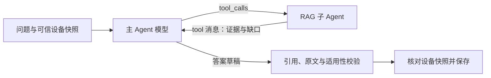
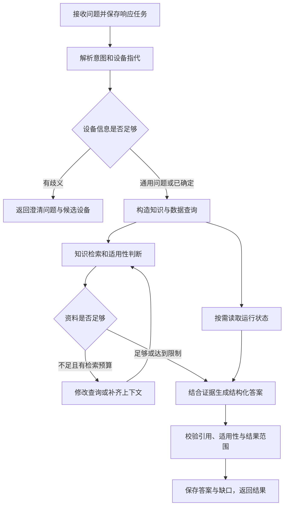
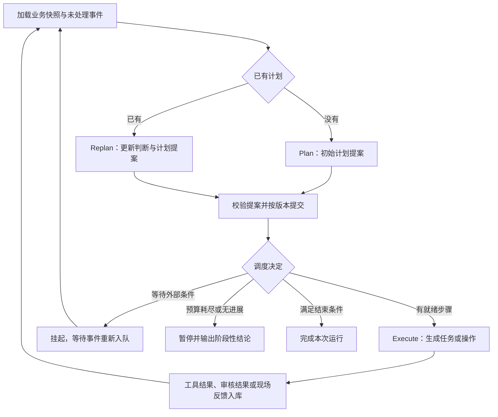

# 算力中心硬件运维智能助手技术设计

| 项目 | 内容 |
| --- | --- |
| 版本 | V1.5 |
| 日期 | 2026-10-01 |
| 依据 | [总体设计](hardware-operations-agent-overall-design.md)，尤其是第 7.1 节 Plan–Execute–Replan 诊断循环 |
| 配套任务 | [实施任务与验收顺序](hardware-operations-agent-implementation-plan.md) |
| 已确定技术栈 | Go + CloudWeGo Eino（`github.com/cloudwego/eino`） |
| 本文产出 | 实现默认值、模块接口、数据与执行约定、普通问答首期范围 |
| 当前状态 | QA-01、QA-02、CCE单页RAG评测、用户指南全目录入库、表格图片专项处理及主 Agent 自主调用知识检索子 Agent 已完成；真实DeepSeek文档问答已评测，PostgreSQL、资产与生产设备接入未联调，容量尚未压测 |

## 1. 实现路线

整体应用采用 **Go 语言和 CloudWeGo Eino 框架**实现，包括会话入口、知识接入与检索编排、Agent、设备适配、异步调度及回放评测。模型推理通过内网接口调用，推理平台的内部实现不属于本项目应用代码。

先完成普通问答、配置指导和只读运行状态查询，再引入持续诊断。两条路径复用设备上下文、知识检索、证据和模型接口。Eino 从首期问答开始接入；Plan–Execute–Replan 用于需要持续收集证据和调整步骤的诊断任务。

沿用总体设计的业务约定：多型号、多版本；检索不匹配优先纠偏；动态 CLI 由当前对话发起用户按次审核；操作说明展示原因和手册出处（如果有）；根因确认与恢复状态分别记录。

### 1.1 已确定技术栈与配套默认值

Go 与 Eino 为用户确定的实现约束；HTTP、数据库访问、迁移及存储是配套默认建议，可按内网基础设施调整。开始编码时选择兼容的 Go 工具链、Eino 和扩展版本，并通过 `go.mod`、`go.sum` 锁定依赖。

| 用途 | 选型或默认建议 | 选择理由与范围 |
| --- | --- | --- |
| 应用代码 | Go、`context.Context`、显式类型与校验函数 | Go struct 表达计划和结果，使用 JSON 标签对接模型与 HTTP |
| HTTP 与 SSE | Go 标准库 `net/http`、`encoding/json` | 实现既定 HTTP 接口、流式进度和取消传播 |
| 问答与诊断编排 | Eino `compose.Graph`，线性子流程可用 `compose.Chain` | 显式组织问答分支、Plan、Execute、Replan 和业务校验节点 |
| 业务事实与任务 | PostgreSQL、`pgx`，SQL 访问代码可用 `sqlc`，迁移采用 `goose` | 用事务统一保存计划、证据、审批、运行状态和待处理事件 |
| 知识检索 | Elasticsearch HTTP 适配器、自定义 Eino Retriever | 用户于2026-09-20确定ES；提供词项和向量两路候选，应用层融合与适用性校验 |
| 模型与向量化 | Eino ChatModel、Embedding 接口，按需使用 `eino-ext` 或自定义 Go 适配器 | 对话模型、embedding、可选 reranker 分别配置；接入内网模型 |
| 原始资料与附件 | 内网对象存储；开发时使用本地目录 | 保存手册、必要的日志片段、现场照片和输出附件 |
| 初期异步推进 | Go worker、PostgreSQL 任务表和事务 outbox | goroutine 在并发额度内执行，长等待持久化挂起 |
| 测试与回放 | Go `testing`、`httptest`、回放适配器 | 使用 `go test` 验证行为，使用 `go test -race` 检查并发路径 |

首期以模块化 Go 应用部署，会话入口和后台 worker 可分别扩容。Eino `CheckPointStore` 由项目实现 PostgreSQL 适配，用于恢复图的计算位置；业务表仍是计划版本、审批和命令执行事实的权威来源。框架检查点与业务事务分别核对一致性，不能假定它们自动原子提交。

Elasticsearch 的向量能力、中文分词配置和所选模型的结构化输出能力，在接入时验证。当前CCE实验已验证ES 9.5.4、内置CJK分词和BGE向量。03h起主 Agent 要求 Eino `ToolCallingChatModel` 和上游原生工具协议，不支持时明确失败；最终答案仍使用文本 JSON 加业务校验，不要求上游原生 JSON Schema 输出。

### 1.2 首期可交付范围

首期交付从“问题进入”到“带引用的答案返回”的完整路径：

1. 导入并发布多型号、多版本知识。
2. 接收问题，解析设备身份和必要的版本信息。
3. 执行混合检索、适用性校验和有预算的检索纠偏。
4. 按需从已有监控系统读取状态，或在开发评测中使用明确标注的回放数据。
5. 返回答案、引用、数据时间、缺口和必要的澄清问题。

首期配置问答输出指导文本；设备命令执行在后续审核执行阶段接入。需要持续诊断的问题保留上下文并说明当前能力范围，待诊断模块完成后转入正式诊断运行。

### 1.3 Eino 能力与业务模块的对应关系

| Eino 能力 | 本项目用途 | 由业务代码补充的约束 |
| --- | --- | --- |
| `compose.Graph`、Lambda 节点与 Branch | 问答分流、检索纠偏、诊断阶段路由 | 适用性、计划版本、审批、预算和结束条件 |
| `components/model`、`components/prompt` | 生成答案、初始计划和重规划提案 | 提示模板版本、Go 类型解码、证据与引用校验 |
| `components/retriever`、`components/embedding`、`schema.Document` | 知识召回、向量化和片段传递 | 型号版本匹配、专家发布状态、冲突与缺口 |
| `components/tool` | 封装可调用的监控、知识及设备能力 | 具体动作审核、下发去重、结果不明时核对 |
| `compose.CheckPointStore` 与 Graph 中断恢复 | 保存并恢复需要外部输入的执行位置 | 运行租约、业务状态刷新、跨实例恢复与版本兼容 |
| `callbacks` | 模型、检索和工具调用观测 | 关联事件、计划、步骤和业务指标 |

主循环采用显式的 Eino Graph：本项目需要结构化依赖、批量就绪检查、计划版本提交以及多个等待原因。Eino 另有 `adk/prebuilt/planexecute`，其默认计划是顺序步骤列表，也提供自定义计划和 Agent 的扩展点；这里保留本项目的 `DiagnosticPlan` 与调度规则，用 Graph 明确表达这些约定。业务层仍将整套流程视为一个主诊断 Agent。

Graph 接入按 Eino `compose` 的中断与检查点机制实现。ADK 的 `Runner.Resume` 属于另一层接口，不直接用于恢复本方案的 Graph；若后续在局部使用 ADK Agent，需在适配层处理对应的事件与恢复方式。

### 1.4 当前实现进度（QA-01）

已实现 `cmd/hwopsd` 和 `cmd/hwops-demo`，使用 Go 1.26.8 验证，依赖锁定 Eino v0.9.19、pgx/v5 v5.7.6。03h将实际问答图更新为主模型 `agent → tools → agent` 循环，模型结束工具调用后进入 `validate`，通过公开 HTTP 验收和 race 检查。具体协议与边界见第1.7节。

本次交付包含文本/Markdown 修订与发布、通用知识词项检索、Eino ChatModel 适配、引用存在性和内容一致性校验、异步响应持久化、撤回复核和重启恢复。HTTP 入口位于 `internal/transport/httpapi`，会话与后台 worker 暂在同一进程。存储提供开发文件实现及 PostgreSQL 实现；PostgreSQL 使用幂等初始建表 SQL，正式迁移版本管理后续补齐。

QA-01 阶段本地验证采用显式 `REPLAY` 摘录或外部 HTTP 模型桩，真实模型与数据库接入未验收。该阶段仅采用已发布的 `GENERAL` 资料；设备版本匹配已由 QA-02 补齐。混合检索已由第1.6节实验接入；多轮上下文、幂等请求、SSE、分布式调度及诊断检查点仍为后续实现约定。

当前可调用接口、配置与运行限制见 [README](../../README.md)；完整验收记录见 [QA-01 工单](../../.scratch/hardware-operations-agent/issues/01-qa-01.md)。

### 1.5 QA-02 已实现的设备版本匹配

通过 `PUT /v1/devices/{id}` 录入完整设备快照，记录名称、别名、型号、固件、驱动、硬件修订、来源、观察时间和数据模式。新观察时间必须晚于已保存时间；不自动补成最新版本。当前为显式快照录入，尚未连接真实资产系统。

问题支持 `device_id`、精确 `device_query` 和正文中的已登记名称解析；多个候选、与显式选择冲突或指定设备不存在时先澄清。每条消息保存独立 `device_context` 和 `context_revision= snapshot_id`。不继承上一条消息的设备；第 4.1 节的多轮指代由 QA-05 实现。

版本精确匹配或使用绑定型号的不可变 `VersionPolicy`。通过知识接口登记固件、驱动各自的版本顺序和来源，知识修订关联 `policy_id` 和包含两端的范围。未登记、跨产品规则或无法解释的范围按 `UNKNOWN` 处理，不自行采用字典序或通用语义版本比较。新规则生成新 ID，旧知识保持原引用。

Eino 检索节点先评估所有词项候选的适用性，保存三态及逐字段理由，再从 `MATCH` 片段中应用 8 条、48 KiB 预算。模型输入和设备资料引用携带设备快照。生成后重新校验资料发布状态和适用性；最终保存时在文件事务或 PostgreSQL 行锁事务中核对设备当前快照，期间更新则返回缺口并丢弃待发布答案。已保存历史回答不改写。

本地 HTTP 验收覆盖两型号各两版本、精确与范围判断、歧义和冲突、通用问题、并发消息、生成期间更新、重启及旧文件兼容。四组对照和并发测试使用外部 HTTP 模型桩与真实临时文件存储，结果标记 `REPLAY`。PostgreSQL 新增 `002_devices.sql` 并扩展可选集成测试；未配置真实数据库，因此未将数据库、模型质量、资产接口或真实产品版本规则记为验收通过。详见 [QA-02 工单](../../.scratch/hardware-operations-agent/issues/02-qa-02.md)。

### 1.6 Elasticsearch / Phoenix 文档RAG实验

用户指定Elasticsearch文档库、本地轻量中文embedding、Phoenix和外部DeepSeek。当前实现增加`internal/adapters/elasticsearch`及可注入的检索接口；主请求仍通过Go + Eino执行，Python仅负责模型服务、Phoenix和离线评测编排。

ES保存不可变原文修订、片段及512维向量；业务存储仍持有发布状态和知识事实。发布需等待索引就绪；召回先限定已发布且适用的修订，再应用每路20条候选预算，返回后重新核对原文与适用性。支持BM25、Dense和Go客户端RRF，后者常数60，不依赖ES企业版融合能力。默认本地检索保留8条上限，ES问答上限5条，两者均受48 KiB上下文预算限制。

本地`BAAI/bge-small-zh-v1.5`固定revision，CPU两线程、CLS pooling和L2归一化。DeepSeek `deepseek-flash`通过官方API实际生成，禁用thinking。`internal/observability`使用OTel/OpenInference记录CHAIN、RETRIEVER、EMBEDDING和LLM，响应保存trace_id、召回片段及真实usage；离线评审另记EVALUATOR，密钥与认证头不进入追踪。

华为云CCE《高危操作一览》形成55条证据行和1条前言。冻结66道题，开发25题、独立验收41题；开发集Recall@5由BM25的97.83%提升至Dense的100%，最终验收38道可回答题宏平均Recall@5为93.42%。Phoenix保存2个数据集、6个实验、182个run和607个span。LLM正确性均分91.46%，属于同模型评审，非人工认证。

统计、错误案例、模型用量和复现见[实验报表](../../reports/rag-cce-20260920/report.md)及[03a工单](../../.scratch/hardware-operations-agent/issues/03a-rag-es-phoenix.md)。该实验补齐检索与评测基础，不代表QA-03全部冲突纠偏或QA-06综合场景完成；实时资产、PostgreSQL及生产硬件仍未验收。

后续03b以同一页面左侧“用户指南”导航树为固定边界，保存757个导航节点及哈希；116个纯分类节点不重复发布，641篇实际文档规范化为Markdown并发布到`hwops-cce-manual-v1`。每页保留标题、目录路径、规范来源、更新时间、表格、代码和链接，最终形成641个不可变修订和3539个不超过12 KiB的检索片段。稳定别名在目录、文件哈希、ES计数及10次跨目录BM25/Dense公共接口检索全部通过后切换。

全目录发布使用REPLAY模型模式，避免把批处理误记为真实问答质量；向量仍由本地BGE真实推理生成。采集和发布分别使用可原子写入的checkpoint，内容或目录哈希变化时拒绝沿用旧索引版本。证据与复现见[03b工单](../../.scratch/hardware-operations-agent/issues/03b-cce-full-manual-ingestion.md)、[全目录入库报告](../../reports/rag-cce-manual-20260920/report.md)和[RAG运行说明](../../scripts/rag/README.md)。

03c增加111题的全目录代表性评测，按文档/相近主题隔离75开发题和36验收题。检索实测发现长片段向量截断与融合丢失强词项结果，新增`HWOPS_RRF_CONSTANT`（1..1000，默认60）；RRF=1开发参考锚点Recall@5为97.10%，原60为92.75%。真实DeepSeek开发集由LIVE-R00经Agent证据复核的48/75（64%）提升到LIVE-R04和LIVE-R05的72/75（96%）。原v1独立验收为34/36（94.44%），因查看两个服务失败结果已退休；达到95%仍需全新未使用题集验收。所有轮次和bad case保留在[03c迭代记录](../../reports/rag-cce-manual-eval-20260920/iterations.md)，检索命中率不代替整题准确率。

生成草稿现支持`gaps`，最多12项、每项非空且不超过2000字节。无结论时保存具体缺口；有依据的结论与缺口并存时返回`PARTIAL`并保留引用，最终保存仍核对设备快照。模型上下文携带文档标题、章节与来源，避免只有“前提条件”等通用章节名而丢失所属对象。确定性公开HTTP回归为REPLAY，真实生成质量由上述独立轮次评估。

LIVE-R03已完成，Agent复核58/75（77.33%），独立验收仍未使用。LIVE-R04候选通过`HWOPS_EVIDENCE_SELECTION`启用一次证据选择调用：ES两路各20条去重后最多40条，对前8条候选补入同修订相邻片段、额外最多8条；候选经过权威原文、发布及适用性核对。选择模型只接收问题、候选预览和设备上下文，预览初始每片段1600字符、整体最多256 KiB；只接受候选内至多5个唯一ID，再次核对状态，最终完整证据JSON最多48 KiB。公共搜索接口仍遵守原top_k契约。响应保存候选、扩展ID、输入与最终上下文字节数，额外调用及后续失败时已消耗用量均保存。

源文档头中的目录与更新时间提取为有界`document_context`，沿模型、原文HTTP接口和引用传递；最终答案按引用修订展示资料范围，确保历史/弃用范围不依赖模型复述。生成采用结论加直接相关原文段落，保留并列事实并区分复用与销毁等操作目的；模型显式固定temperature=0，DeepSeek仍禁用thinking。这些改动已通过公开HTTP红→绿及全量race，开发集真实全量结果为72/75。

当前开发文件存储不适合641篇全量知识和持续评测：状态文件约63 MiB，`filestore.transact`对读取也复制完整JSON状态；证据选择路径又对最多40个候选和8个相邻片段逐项读取修订。LIVE-R05公开HTTP端到端p50为42.9秒、p95为52.4秒；可回读的65条Phoenix根trace中检索平均24.3秒，而两次模型调用合计平均4.4秒。生产及容量验证应使用PostgreSQL；文件实现若继续用于大语料评测，应改为内存只读快照和批量修订读取，并避免在每个响应中重复保存全部641条适用性`MATCH`结果。

03d新增显式启用的语义增强索引流程。LLM只输出原文块边界，程序校验连续行范围、完整覆盖、大小和哈希；表格按完整行保护，图片只根据Markdown、URL及相邻文字生成语境描述。每个片段生成2至5个候选问题，正文、问题、表格描述和图片描述分别向量化并通过nested表示绑定原片段。超过BGE输入上限的长语义片段使用480-token有重叠PASSAGE表示，不写截断的整片段向量。

查询侧实现Eino Retriever接口的多问题检索模块，保留原问题并累计至少两个有效改写，将发布/适用性过滤选项传入各并行路由，再按片段ID融合。查询间采用RRF=1且原问题权重为2，避免泛化改写压低强词项证据。`hwops-cce-manual-v2`包含641个修订、5458个片段和31980个nested向量表示；详情见[03d工单](../../.scratch/hardware-operations-agent/issues/03d-rag-semantic-enrichment.md)和[评测报告](../../reports/rag-cce-manual-rag-v2-20260923/report.md)。

03f在03d连续原文边界上增加表格和图片专项处理。说明型表格按原始数据行拆开，
由LLM重写为自包含段落；数据型表格生成摘要并经第二次逐表事实复核。图片使用
实际图片字节调用视觉模型，同一URL按内容缓存；视觉描述记录原始行范围，并在
回答上下文中插回Markdown图片标记之后。引用正文、行号和SHA256保持不变。

Elasticsearch同时保存原始`content`和增强`retrieval_content`。BM25检索增强
字段；dense输入移除图片URL、Markdown链接目标及结构符号，但保留参数、命令、
数值和单位。`TABLE_TEXT`、`TABLE_SUMMARY`、`IMAGE`及`PASSAGE`作为nested
向量绑定原片段，命中后仍返回可核验原文。公开搜索调用外部查询改写模型时使用
稳定查询指纹作为模型会话ID，避免无会话请求被上游拒绝。

最终`hwops-cce-manual-v3-r1`包含641个修订、5585个原文片段和42571个nested
向量。独立专项集包含60题；最终未使用的20题保留集Recall@5和完整证据命中率均
为95%，真实问答经模型评审及固定证据复核为20/20，引用完整性100%。标签由AI
基于来源整理，未经运维专家认证；详见[03f工单](../../.scratch/hardware-operations-agent/issues/03f-rag-multimodal-assets.md)。

### 1.7 主 Agent 与知识检索子 Agent

RAG 查询编排收敛到 `internal/agents/knowledge`。该模块实现 Eino `adk.Agent`，并通过 `adk.NewAgentTool` 暴露为 `retrieve_hardware_knowledge`。工具输入只有自包含的知识问题；设备快照由主 Agent 或工作流通过可信 `context.Context` 注入，子 Agent 校验快照标识和 `data_mode`，不接受模型自行声明设备身份。

子 Agent 内部负责查询改写、并行召回、发布状态与适用性过滤、候选扩展、证据选择、48 KiB预算、引用构造及缺口分类。结果返回 `FOUND`、`NEEDS_CONTEXT`、`NOT_FOUND` 或 `FAILED`，并携带原文证据、结构化引用、适用性检查、实际检索问题、trace、数据模式、证据选择记录及模型usage。`FAILED`在工具协议中保留已经产生的观测信息，可信调用适配器随后还原为Go error，主流程不得把失败结果当作证据。

03h起，`internal/einoflow` 通过 `ToolCallingChatModel.WithTools` 将该 AgentTool 注册给主模型。首次调用只提供问题、设备快照和工具定义；模型自主决定检索问题、继续检索或结束。知识子 Agent 不生成最终答案、不判断设备实时状态，也不执行设备操作。未来诊断主 Agent 可复用同一工具。



`chatmodel.OpenAI`实现不可变工具绑定、`tools`、`tool_calls`、`tool_call_id`及`tool_choice`序列化，接受`content:null`的纯工具回复。基础模型继续供查询改写和证据选择使用，不携带主 Agent 的工具定义。主模型使用`auto`并关闭并行工具请求；答案格式或引用无效时只允许一次`tool_choice=none`修正。显式`REPLAY`模型产生确定性工具调用与摘录。

主 Agent 执行边界：

- 只接受`retrieve_hardware_knowledge`及`{"request":"自包含问题"}`，拒绝未知字段、空请求、超长参数、重复调用ID和尾随JSON；可信调用器注入设备上下文。
- 最多三次知识调用，大小写与空白归一化后禁止重复请求。非法调用返回`INVALID_MODEL_OUTPUT`，重复请求或调用次数超限返回`TOOL_BUDGET_EXCEEDED`，工具失败立即结束。图最多12步，排队和全部模型、工具调用共用原60秒预算。
- 主模型累计证据 JSON 最多48 KiB，按片段ID去重；新工具消息仅携带新增证据，重复证据用`previously_returned_fragment_ids`标识，超预算片段不进入允许引用集合。
- 无检索证据时只允许空`claims`和具体`gaps`；有证据的最终结论继续校验权威原文、发布状态、适用性及保存时的设备快照。
- `Response.knowledge_tool_calls`保存每次调用的ID、名称、请求、状态、提供的片段ID、实际检索问题、缺口、trace、证据选择、用量和错误；失败及重启读取保留记录。主模型与证据选择的返回usage累加至响应；查询改写仍通过独立LLM trace观测，尚未并入该汇总。

确定性公开HTTP验收使用外部模型桩和真实临时文件存储，标记REPLAY，覆盖模型改问重查、无检索结束、可信设备、非法调用、预算、引用及失败记录。2026-10-01真实`deepseek-v4.1-flash`通过一次知识工具调用和两次主模型调用完成公开HTTP烟测，使用合成手册、本地词项检索，未启用查询改写与证据选择；不计作CCE全量质量评测。证据见[03h工单](../../.scratch/hardware-operations-agent/issues/03h-main-agent-rag-tool.md)。

## 2. 模块与接口

### 2.1 代码组织建议

以下是整体目标布局；QA-01 已生成对应的问答入口和业务代码，独立 worker、诊断和回放评测目录随后续任务落地。

```text
go.mod
go.sum
cmd/
  hwopsd/main.go      # HTTP / SSE 入口
  hwops-worker/main.go # 异步任务与诊断执行
  hwops-eval/main.go  # 回放与效果评测
internal/
  agents/knowledge/    # 可由主 Agent 调用的内部知识检索子 Agent 与 AgentTool
  application/        # 会话请求、问答流程、诊断入口
  knowledge/          # 入库、发布、检索、适用性与引用
  evidence/           # 设备身份、运行观察、拓扑与时间对齐
  diagnosis/          # 计划、候选原因、Plan–Execute–Replan
  actions/            # 操作、审批、下发与结果核对
  runtime/            # 任务、事件、租约、预算、恢复
  einoflow/           # Eino 图构造、阶段节点和调用适配
  adapters/           # 模型、检索、监控、设备执行、存储
  transport/http/     # HTTP、SSE、外部事件接入
migrations/           # PostgreSQL SQL 迁移
test/
  acceptance/         # 通过公开接口验证用户场景
  contracts/          # 适配器输入输出及错误语义
  replay/             # 时间约束下的故障回放
testdata/             # 明确标注的测试资料与回放输入
```

Go 单元测试与被测代码放在同一包目录，使用 `*_test.go`；跨模块测试放在 `test/`。围绕实际差异引入适配器：模型端点可能不同，监控系统与设备接口不同，实时查询与回放查询不同。业务模块不依赖具体监控响应字段或厂商 SDK。

### 2.2 公开接口约定

以下是拟定的 Go 方法签名，类型定义由后续实现承载。接口采用 `context.Context` 传递调用时限、取消与追踪信息；业务设备上下文使用显式请求字段。

| 模块 | 接口 | 必须完整表达的结果 |
| --- | --- | --- |
| 会话 | `SubmitMessage(ctx context.Context, req SubmitMessageRequest) (ResponseRef, error)` | 响应标识、受理状态、已确认设备上下文 |
| 设备与证据 | `ResolveDevice(ctx context.Context, req ResolveDeviceRequest) (Resolution, error)` | 唯一结果、多个候选、未找到或查询失败 |
| 设备与证据 | `Observe(ctx context.Context, query ObservationQuery) (ObservationBatch, error)` | 观察值、时间、覆盖范围、来源和获取状态 |
| 知识 | `Retrieve(ctx context.Context, req RetrievalRequest) (RetrievalResult, error)` | 可用片段、适用性、出处、检索尝试和缺口 |
| 知识 | `Publish(ctx context.Context, req PublishRequest) (PublicationResult, error)` | 被审核的修订、适用范围与索引发布状态 |
| 诊断 | `ProposePlan(ctx context.Context, state DiagnosticState) (PlanProposal, error)` | 候选原因、增量步骤、依赖和结束条件 |
| 诊断 | `RevisePlan(ctx context.Context, req ReplanRequest) (ReplanDecision, error)` | 继续、等待、暂停或完成，以及计划差异和依据 |
| 操作 | `PrepareAction(ctx context.Context, req PrepareActionRequest) (Action, error)` | 确定的目标、命令或工具参数、原因与依据 |
| 操作 | `Decide(ctx context.Context, req ActionDecisionRequest) (ApprovalResult, error)` | 审批决定、绑定内容及冲突信息 |
| 操作 | `Dispatch(ctx context.Context, actionID string) (ExecutionRef, error)` | 下发尝试、执行状态、查询结果的引用 |
| 运行 | `ApplyEvents(ctx context.Context, req ApplyEventsRequest) (RunSnapshot, error)` | 新状态版本、待调度任务或版本冲突 |

模型输出是计划或判断的提案。程序校验后，才写入可执行计划和动作。HTTP、框架节点与业务模块使用相同接口，避免在入口和 worker 中重复实现适用性、审批或状态判断。

上游查询失败被适配层整理为第 3.3 节的业务获取状态，并保留具体错误信息；无法形成有效结果的内部故障和调用取消通过 `error` 返回。HTTP 断线不取消已持久化的任务，worker 使用自身的任务上下文与预算；对单次调用的取消始终向下游传播。

## 3. 数据约定

### 3.1 公共字段

所有对象以 Go struct 定义并携带 `schema_version`，使用 JSON 标签固定外部字段名。时间在 Go 中使用 `time.Time`，序列化为带时区的 UTC 时间；枚举、必填字段、引用关系和业务前置条件由显式校验函数检查。内部设备标识与监控系统标识分开保存，通过映射关联；型号、版本和时间窗口不能只留在自然语言中。

| 对象 | 必备信息 |
| --- | --- |
| `DeviceContext` | `device_id`、设备类型、厂商、型号、硬件修订、部件位置、各版本维度、快照时间、来源 |
| `KnowledgeRef` | `document_id`、`revision_id`、`fragment_id`、章节或页码、原文位置、内容哈希、适用性结果 |
| `Evidence` | 目标与部件、观察时间、获取时间、数据覆盖范围、字段及单位、来源、原始引用、获取状态 |
| `Claim` | 结论文本、设备上下文引用、支持与反对证据引用、知识引用、尚缺信息 |
| `Response` | 响应状态、答案、claims、引用、数据时间、缺口、下一步、数据模式 |
| `Action` | 操作标识、目标、工具与参数或完整 CLI、原因、依据、前置条件、审批内容摘要、状态 |

`data_mode` 至少区分 `LIVE` 和 `REPLAY`。演示数据、确定性测试模型和模拟执行只能证明程序流程，不能当作真实设备状态或实际模型效果。

### 3.2 版本适用性

知识适用性返回 `MATCH`、`MISMATCH` 或 `UNKNOWN`，并附逐项判断理由。

- 明确匹配的型号与版本，以及专家发布的通用适用范围，才可得到 `MATCH`。
- 版本缺失、无法解释的版本范围、未知硬件修订，按相关条件返回 `UNKNOWN`。
- 任一必要条件明确不满足时返回 `MISMATCH`。
- 固件、驱动和硬件修订分别比较，按具体产品的版本规则解析；不把厂商版本字符串直接按字典序或通用语义版本比较。

未知信息先通过设备查询补齐。对于通用问题，仅校验资料声明需要的条件；无需为了回答版本无关的问题强制收集全部版本。

### 3.3 查询结果语义

| 状态 | 含义 | 下游处理 |
| --- | --- | --- |
| `OK` | 取得符合请求范围的数据 | 记录观察值与覆盖范围 |
| `NO_RECORD` | 查询成功且在声明范围内无记录 | 保留查询范围，按判据解释 |
| `PARTIAL` | 只返回部分请求数据 | 分别标记可用部分和缺失部分 |
| `FAILED` | 查询调用失败 | 不推断设备故障 |
| `STALE` | 数据超过本次查询的时效要求 | 展示时间并安排刷新 |
| `UNSUPPORTED` | 当前适配器不支持该查询 | 明确能力缺口 |

缓存键包含设备、部件、能力、参数、时间窗口、设备快照版本和数据模式。证据复用仍需校验时效；“同一设备查询过”不足以复用。

## 4. 首期问答实现

### 4.1 请求处理



流程只等待本次问题实际需要的分支。状态查询不强制等待无关手册；只有知识、没有运行数据时，不回答设备当前处于正常状态。

用户继续问“它”或“这条告警”时，可以复用已确认的目标。出现新设备名或冲突标识时重新解析。请求中保存 `context_revision`，避免并发消息把设备 A 的版本错误带入设备 B 的问题。

问答以 `compose.Graph` 表达分流和检索纠偏，线性的“提示模板 → ChatModel → Go 解码校验”可封装为 Chain 子流程。Retriever 适配器通过 `schema.Document` 携带片段与元数据，同时在业务结果中保留检索尝试和缺口。数据库访问、发布状态核对和答案校验使用 Go Lambda 节点，模型不能自行绕开这些节点。

### 4.2 知识发布与索引

1. 接收原文及来源，保存不可变修订；提取文字、表格、命令和章节位置。
2. 生成候选片段及适用范围，由运维专家复核修订内容和适用范围后发布。
3. 词项索引与向量索引保存同一 `revision_id`、`fragment_id`、内容哈希及索引代次。
4. 只有已经批准且索引就绪的修订进入正常检索集合。
5. 撤回或替代修订时记录生效时间。读取侧再次核对发布状态，避免异步索引仍返回已撤回资料。

错误码、型号和命令名使用可精确匹配的字段；正文配置适合中文和英文混合资料的分词。表格和命令块保留其标题、前置条件及必要上下文。

### 4.3 混合召回与纠偏

词项召回与向量召回分别产生候选列表，使用基于排名的融合，再进行可选重排。相关性排序不改变型号版本的适用性。

检索处理两类信息：

- 可以用于当前答案或操作的 `MATCH` 资料。
- 用于解释缺口的诊断信息，例如命中的资料为何是 `MISMATCH`、是否缺少设备版本、文档是否尚未入库。该信息不作为适用操作依据。

未找到适用结果时先检查错误码格式、设备别名、术语、查询拆分和父章节，再尝试新的召回方式。每次尝试保存查询指纹；只有查询或上下文发生有效变化才消耗下一次纠偏尝试。

历史案例提供症状与候选原因。未经专家发布为方案的案例，不单独作为可执行步骤的正式依据。

### 4.4 答案与引用

模型先输出 `claims` 和它们的引用，再由呈现模块组织答案。每个设备特定的操作建议关联设备上下文及适用知识，找不到出处时明确说明缺口。

程序可以确定检查引用是否存在、片段哈希是否匹配、资料是否适用、指标值是否来自返回的证据。引用是否充分支持自然语言结论，还需要模型辅助核验和人工标注评测，不能把引用存在当作语义正确的证明。

校验失败时，在本次总预算内进行一次修正；仍失败则输出可确认内容和缺口。首期 SSE 流式发送检索进度及已校验的答案片段，避免把尚未核对的命令建议直接作为最终答案显示。

`Response.status` 使用 `ANSWERED`、`PARTIAL`、`NEEDS_CLARIFICATION`、`UNRESOLVED` 或 `FAILED`。缺少知识和模型端点故障分别记录。

## 5. Plan–Execute–Replan 实现

### 5.1 运行图



Eino Graph 的每次 worker 调用在预算内推进有界工作，遇到长时间外部等待时退出或中断，将等待表现为持久化状态。工具 worker 返回结果后写入业务事件；模型调用、工具调用各有独立并发额度，挂起任务不靠长期占用 goroutine 等待。

### 5.2 状态与计划

`DiagnosticState` 是模型推理和工作流推进使用的快照，至少包括：

| 字段 | 作用 |
| --- | --- |
| `incident_id`、`run_id` | 事件与本次排查身份 |
| `state_version`、`event_cursor` | 版本校验与已处理事件位置 |
| `phase`、`lifecycle_status` | PLAN/EXECUTE/REPLAN 与 RUNNING/WAITING 等分别记录 |
| `device_snapshot_refs` | 设备身份、版本及拓扑上下文 |
| `hypotheses`、`evidence_refs` | 候选原因和证据 |
| `plan_id`、`plan_version`、`steps` | 当前计划、依赖和步骤进度 |
| `pending_action_refs`、`human_task_refs` | 已下发、待审核或待现场的事项 |
| `budget_remaining`、`termination_conditions` | 执行预算与完成条件 |

Plan 和 Replan 返回结构化提案，而不直接修改数据库：

| 提案字段 | 约定 |
| --- | --- |
| `base_state_version`、`base_plan_version` | 说明提案依据的快照版本 |
| `hypothesis_updates` | 状态变化、证据引用、确认或排除理由 |
| `step_changes` | 新增、调整、跳过或失效的未执行步骤 |
| `decision` | `CONTINUE`、`WAIT`、`PAUSE`、`COMPLETE` |
| `reason`、`supporting_refs` | 简明决策理由和实际依据 |
| `wait_reasons`、`gaps` | 等待条件或无法继续的缺口 |

步骤至少定义 `step_id`、`kind`、`target_ref`、`hypothesis_refs`、`depends_on`、前置条件、输入、预期观察和成本。`kind` 可以是知识检索、运行查询、动态 CLI、变更、现场检查或恢复观察。

`expected_observation` 仅描述希望观察什么。实际观察存入 `Evidence`，两者在数据类型和呈现上分开。

### 5.3 提案校验与执行规则

- 步骤标识唯一，依赖存在且无环；就绪步骤的依赖与必要前置条件必须满足。
- 目标设备可唯一解析，知识引用与设备版本匹配；获取缺失上下文本身可以是合法步骤。
- 引用证据存在且属于允许的事件上下文，时间与数据模式一致。
- 已下发或结果不明的动作保持原身份，不通过重规划生成等价动作重复下发。
- 同一条件下重复步骤需要说明新增信息或有效重试理由，并计入预算。
- `COMPLETE` 同时提交本次结果、根因状态与恢复状态；只有满足确认判据的原因才能标记已确认。

版本冲突时丢弃过时提案，重新读取状态。可以合并一小批已到达事件后进行 Replan；合批间隔和最大事件数通过压测配置。审核同意但证据未变化时，可由程序沿用已保存计划，仍记录经过 REPLAN 决策，不强制再调用模型重新生成整份计划。

### 5.4 检查结果与完成条件

根因确认判据以发布的规则和必要观察表达；现场直接证据需要核对目标、时间和相应检查要求。模型可以提议状态变化，程序检查判据引用及已获得证据。

没有可执行的确认判据时保留“有证据支持”等状态，并给出待验证内容。模型输出的概率或自评不能替代确认。

多条独立分支可以分别等待审核、现场或观察。运行只有在所有分支均无可执行步骤时才整体挂起，`wait_reasons` 保存完整等待集合；新事件可以唤醒其中一个分支。

运行结束前检查所有已下发动作的跟踪责任。未完成或结果不明的动作继续由执行模块跟踪，并在结果中显示，不能因本次诊断输出完毕而遗失。

### 5.5 Eino Graph 节点与恢复约定

下列名称是本项目的节点名；业务函数通过 `compose.InvokableLambda` 包装，再使用 Graph 的 `AddLambdaNode` 方法加入图，模型子流程使用 ChatModel 节点。具体调用签名随锁定版本核实。

| 项目节点 | 实现职责 |
| --- | --- |
| `load_state` | 从业务数据库读取最新快照、计划版本和未处理事件 |
| `plan` | 调用同一主 Agent 的规划提示与 ChatModel，输出 `PlanProposal` |
| `replan` | 结合新增证据生成 `ReplanDecision`，或确定性地沿用有效计划 |
| `validate_commit` | 用 Go 校验类型、引用、依赖和预算，通过版本检查提交提案 |
| `execute` | 将就绪步骤转成持久化任务或具体操作，短只读调用可同步完成 |
| `route` | 用 Graph Branch 选择继续、等待、暂停或完成 |
| `wait` | 保存等待原因与恢复引用，按需触发 Graph 中断 |
| `finalize` | 保存已校验的结果、根因状态、恢复状态及未完成动作 |

使用 `compose.NewGraph` 构造图，经 `Compile` 得到可执行对象。图内循环受本次预算和框架最大步数共同限制；外部结果到达后由运行调度重新唤醒，避免再由另一套无界循环同时推进同一事件。

图需要原位置恢复时，编译时通过 `compose.WithCheckPointStore` 配置持久化实现，运行时通过 `compose.WithCheckPointID` 关联本次框架调用。中断节点可使用 `compose.StatefulInterrupt` 保存恢复所需状态；恢复继续使用对应检查点，相关调用按锁定版本接入。

`run_id` 表示业务运行，`checkpoint_id` 表示某次框架执行的恢复点，另行保存二者映射、图版本与状态版本。中断展示信息不能作为唯一持久化来源：审批卡片、等待事项和业务状态先入库，框架状态只保存可序列化内容及业务引用。

恢复后的节点可能重新进入，必须先重新核对业务版本、审批与动作状态，再执行后续逻辑。业务状态已前进、图版本不兼容或检查点缺失时，从最新业务快照启动新一轮 Graph，保留原执行历史。检查点适配器通过运行租约防止过期持有者覆盖当前恢复点。

## 6. 持久化、并发与命令执行

### 6.1 事件推进

每个运行维护递增的 `state_version`。一个数据库事务内完成：检查当前版本、保存计划或步骤变化、追加业务事件、写入待处理 outbox。事务提交后 worker 才能看见任务。

| 情况 | 处理 |
| --- | --- |
| 任务重复投递 | 按业务事件标识或任务幂等键识别，已处理事件不重复应用 |
| 两个 worker 同时推进 | 用租约与状态版本检查确定提交者；过期持有者不能提交新计划 |
| 提案生成期间收到新证据 | 提交时发现状态已变化，重新读取并评估 |
| 提交后、任务发布前崩溃 | outbox 补发尚未交付任务 |
| 工具结果晚于新计划 | 结果归档到原动作，再作为新事件判断当前适用性 |
| Eino 检查点落后 | 从业务表加载最新事实与未处理事件，不能回退业务状态 |
| Eino 恢复时重新进入 Execute 节点 | 复用已保存的任务和操作标识，先检查状态再采取动作 |

同一运行的事件序号在持有运行记录锁的事务中分配，消费者按已提交序号推进 `event_cursor`。同时保留上游实际发生时间，不能把数据库接收顺序当作物理故障的因果顺序。

消息投递允许至少一次，业务状态转换保持幂等。外部设备命令是否具备幂等能力，取决于具体适配器，不能仅凭工作流检查点承诺命令恰好执行一次。

### 6.2 操作审核与下发

1. 保存不可变的待审核操作内容，包括设备、部件、完整命令或工具参数、原因、依据及前置条件。
2. 服务端从当前已认证对话上下文取得审核用户，检查其为该处理对话的发起用户。请求体中的用户编号不能单独作为身份凭据。
3. 将审核决定绑定到 `action_id` 与内容哈希。未变更操作的一次有效审批可用于该次执行；新目标、命令或参数生成新操作并重新审核。
4. 下发前在事务中核对审批、设备上下文及前置条件，取得设备变更互斥权，并记录本次下发尝试。
5. 事务提交后调用设备适配器，保存返回值、执行状态与新证据。

审批卡片展示用户要求的目标、完整操作、操作原因和手册出处；相关业务任务的影响分析不作为审批接入前提。

自动告警没有处理对话时，只提出待审核操作。人员进入事件并发起处理对话后再发起审核。跨班次可继续查看和处理事件，新对话提出的操作绑定其发起用户；不能把旧审批重新绑定成另一人的同意。

### 6.3 结果不明的处理

动作状态至少包括 `PROPOSED`、`WAITING_APPROVAL`、`APPROVED`、`REJECTED`、`DISPATCHING`、`SUCCEEDED`、`FAILED`、`UNKNOWN`、`INVALIDATED`。

动作进入 `DISPATCHING` 后，若发生网络超时、worker 崩溃或缺少可靠回执，恢复任务首先判断是否能通过远端操作标识查询结果。没有确定信息时记为 `UNKNOWN`。

- 远端支持幂等操作键与结果查询时，使用原键核对。
- 远端不支持时，查询设备实际状态、日志及指标；仍无法确定则保留结果不明。
- 恢复任务不能仅因为未收到成功回执就再次下发变更。
- 原执行 worker 的有效迟到回执仍归入原操作，核对后更新状态。
- 对相关设备的冲突变更保持等待，直到核对结果或人员明确决定后续处理。

即使崩溃发生在记录下发意图之后、真正调用设备之前，也不能默认操作未执行。没有远端可验证信息时，需要接受暂时无法自动完成的结果，避免用重复下发“补偿”不确定性。

## 7. 存储设计

### 7.1 关系记录

| 记录集合 | 保存内容与主要约束 | 引入阶段 |
| --- | --- | --- |
| `conversations`、`messages`、`responses` | 会话发起用户、上下文版本、消息与已校验答案；消息请求键在会话内唯一 | 首期 |
| `response_events` | 每个响应的递增事件序号，供 SSE 恢复读取 | 首期 |
| `device_snapshots`、`device_mappings` | 内部设备身份、监控对象映射、型号与版本快照 | 首期 |
| `knowledge_revisions`、`knowledge_fragments` | 原文引用、内容哈希、适用范围、发布与撤回时间 | 首期 |
| `retrieval_attempts` | 查询指纹、策略、索引代次、候选及过滤理由 | 首期 |
| `evidence` | 来源、观察时间、获取时间、获取状态、原始引用 | 首期 |
| `jobs`、`outbox` | 可执行时间、优先级、租约、去重键、交付状态 | 首期按问答任务使用 |
| `incidents`、`incident_links`、`alerts` | 原始告警、事件归属、候选关联、合并拆分历史与再发关联 | 诊断与主动排查 |
| `diagnostic_runs`、`run_events` | 当前阶段、工作流状态、版本、预算、事件序号 | 诊断 |
| `graph_checkpoints` | Eino 检查点内容、检查点标识与运行映射、图版本、状态版本和租约约束 | 诊断恢复 |
| `plan_revisions`、`plan_steps` | 不可变计划修订、步骤及依赖；运行当前计划指向已提交修订 | 诊断 |
| `hypotheses`、`hypothesis_evidence` | 候选原因、判据、支持和反对关系 | 诊断 |
| `actions`、`approvals`、`execution_attempts` | 具体操作、审核、下发尝试与结果核对 | 审核执行 |
| `human_tasks`、`human_results` | 现场任务、目标、反馈、附件和交接记录 | 现场协作 |

长期原文、照片和大段输出保存在对象存储，关系记录保存定位信息和内容哈希。知识索引用于召回，状态与发布事实从关系记录核对。

实际字段 DDL 随交付任务逐步落地；首期只创建问答所需记录，后续通过迁移补充诊断对象。

### 7.2 事件关联的一致性

重复告警通过上游事件标识去重，缺少可靠标识时保存候选归属和判断依据。拓扑与时间关系只能建立候选关联；共同原因证据满足条件后才合并。

合并时保存原事件身份和来源关系，原动作与审批仍指向原目标。事务更新事件归属与主运行控制权，并重新校验未下发步骤。已经执行或下发的操作保留原记录。

拆分恢复各事件独立的证据和计划视图，共享证据通过引用保留。故障恢复后再发创建新事件；缓存、证据和审批不能不经检查地跨事件延续。

## 8. 对外接口

### 8.1 首期接口

| 方法与路径 | 用途 | 关键输入或输出 |
| --- | --- | --- |
| `POST /v1/conversations` | 建立会话 | 返回会话标识；发起用户来自已认证上下文 |
| `POST /v1/conversations/{id}/messages` | 提交问题或澄清回答 | `text`、可选设备选择、上下文版本；返回 `202` 与响应标识 |
| `GET /v1/responses/{id}` | 获取已保存结果 | `Response`、数据模式、当前状态 |
| `GET /v1/responses/{id}/events` | 读取处理进度 | SSE，支持 `Last-Event-ID` |
| `GET /v1/devices/resolve` | 查询设备候选 | 名称、编号或监控标识；返回明确状态和候选 |
| `PUT /v1/devices/{id}` | 录入完整设备快照（QA-02） | 各版本、来源、观察时间、数据模式；拒绝观察时间回退 |
| `POST /v1/knowledge/version-policies` | 登记产品版本顺序（QA-02） | 型号、来源、固件与驱动顺序；返回不可变规则 ID |
| `GET /v1/knowledge/version-policies/{id}` | 查询版本规则（QA-02） | 原始顺序及来源 |
| `POST /v1/knowledge/search` | 公开检索接口（03a） | `query`、可选`device_id`、`strategy`、`top_k`；返回适用片段、来源、得分及trace_id |
| `GET /v1/knowledge/revisions/{id}/fragments/{fragment_id}` | 查看引用原文 | 修订、位置、内容、适用范围和发布状态 |
| `POST /v1/knowledge/revisions` | 提交知识修订 | 原文引用、来源、候选适用范围 |
| `POST /v1/knowledge/revisions/{id}/publication` | 专家发布或撤回 | 审核后的适用范围、决定及修订信息 |

写入请求支持 `Idempotency-Key`：同一作用域内同键同内容返回原结果，同键不同内容返回 `409`。设备歧义以 `NEEDS_CLARIFICATION` 返回，外部调用故障保留结构化错误码与可重试信息。

SSE 事件有持久化序号，最少包含 `accepted`、`progress`、`clarification_required`、`answer`、`failed`。连接中断不创建新任务，客户端可以续读事件或读取最终结果。首期答案在校验完成后发布，未校验的模型 token 不直接作为操作建议推送。

### 8.2 诊断阶段接口

| 方法与路径 | 用途 |
| --- | --- |
| `POST /v1/incidents` | 根据用户上下文创建或关联故障事件 |
| `POST /v1/alert-events` | 接收告警发生、更新和恢复事件 |
| `POST /v1/incidents/{id}/runs` | 创建诊断运行，或返回已存在的适用活跃运行 |
| `GET /v1/runs/{id}` | 获取阶段、状态、当前计划、证据与等待事项 |
| `POST /v1/runs/{id}/resume` | 对已暂停运行提交恢复条件或新增信息 |
| `POST /v1/actions/{id}/decisions` | 当前对话发起用户同意或拒绝具体操作 |
| `POST /v1/human-tasks/{id}/results` | 提交文字、附件或测量反馈 |
| `POST /v1/runs/{id}/cancel` | 停止调度新步骤，继续跟踪已下发动作 |

恢复、审批和现场反馈写入事件后异步推进。接口响应“已受理”不代表命令已执行，也不代表故障已恢复。重复或冲突的审核决定必须具有确定结果，不能覆盖已经下发的操作事实。

## 9. 预算、容量与观测

### 9.1 可配置初值

以下数值只用于启动开发验证，实际效果和吞吐需按模型、知识规模及监控接口校准：

| 参数 | 开发初值或设计目标 | 说明 |
| --- | --- | --- |
| 两路检索候选数 | 每路 20 条 | 融合前候选，适用性校验不因候选不足而放宽 |
| 最终知识片段数 | 本地至多8条；已实现ES问答至多5条，均有48 KiB预算 | 目标设计允许必要父章节扩展；当前尚未实现自动扩展 |
| 检索尝试 | 初次加最多 2 次纠偏 | 在总请求预算内执行，禁止等价空转 |
| 模型格式或引用修正 | 最多 1 次 | 仍失败时返回已确认内容与缺口 |
| 开发活跃诊断 | 8 个，集群总量 | 用于功能验证 |
| 正式活跃诊断设计目标 | 128 个，可扩至 256 个 | 依据总体设计演算，待压测 |
| 开发模型调用并发 | 4 个，集群总量 | 独立额度，不随诊断任务数自动增长 |
| 问答总时限 | 60 秒 | 包含排队与重试；目标响应时延另行评测 |
| 单次自动诊断预算 | 300 秒，最多 30 次工具调用、20 次模型调用 | 挂起和排队时间单独统计，恢复不自动重置预算 |
| 拓扑扩展初值 | 最多 2 跳、100 个相关对象 | 是单事件初值，预算受限时输出待扩展方向 |

开发默认值与压测配置分开，不能拿开发吞吐证明十万卡容量。对每个监控适配器设置可配置并发和超时；未知下游承载能力时先限制负载，通过联调测量调整。

知识问答使用独立的排队与模型资源预留。调度的活跃额度在集群范围内生效，通过持久化租约或集中额度管理实现，不能给每个 worker 都配置 128 后视为总量 128。

预算在调度前预留、完成后记账，调用失败同样计入；防止并行分支同时看到相同余额而超用。必要的状态核对计入独立可观测的核对任务，预算耗尽后不能以核对名义继续无界扩展诊断。

### 9.2 追踪信息

每个模型与工具调用关联 `conversation_id`、`response_id` 或 `incident_id/run_id`，并记录计划版本、步骤、操作、模型版本、提示模板版本和知识修订。

Eino `callbacks` 收集模型、Retriever 和工具节点的调用信息，再转换为业务追踪事件；回调不承担审批提交或命令下发。Go worker 记录任务取消、goroutine 执行数和集群额度，SSE 从已持久化的响应事件中读取。

指标分别统计问答、诊断、模型、检索和监控接口的排队时间、调用耗时、重试及失败。复核误诊时可以还原“当时设备版本、召回资料、实际观察、计划变化和最终结论”。

## 10. 评测与交付条件

### 10.1 首期验收接口

首期使用 Go `testing` 和 `httptest`，测试集中在用户可见请求、知识检索公开接口和监控适配器接口。Eino ChatModel 和 Retriever 通过确定性测试实现替换外部依赖，另行记录真实模型联调结果：

- RAG质量评测统一写入Phoenix。冻结数据集按内容SHA256和split绑定dataset，
  每个本地实验绑定独立experiment并保存逐题run及evaluation。Phoenix不可用、
  数据集不一致或远端计数不一致时评测命令失败；本地离线运行必须显式声明，
  不得被报告为已进入统一评测平台。
- 可由Phoenix独立复现的`LIVE`模式、处理终态和引用存在性检查注册为Code
  Evaluator并绑定所有RAG dataset；外部LLM语义判断仍按原rubric单独记录。
- 同一指示灯或错误码在不同型号版本下得到正确的适用解释。
- 设备名称有歧义时先澄清；切换设备后不复用上一个设备的版本。
- 初次召回失败后能改变查询方式，仍不足时准确报告缺口。
- 检索命中不适用版本时不输出该版本的配置步骤。
- 撤回资料不能继续作为新答案的适用依据，旧回答的引用仍可追溯。
- 查询失败、无记录、部分数据和过期数据得到不同表达。
- SSE 断线续读、重复请求不生成重复问答任务。
- 回放或演示结果带数据模式标识，缺少真实模型或监控接口不能报告线上验收通过。
- Eino 图可编译并完成从输入到校验结果的调用，Go 取消、超时及流读取释放符合调用约定。

### 10.2 诊断验收接口

通过提交事件、读取运行、审核动作和回传现场结果等公开接口验证：

- 实际工具结果改变后续计划；审批同意自身不改变根因证据。
- 已有证据可复用，有效前置条件不因重规划被跳过。
- 并行结果迟到、重复投递、版本冲突和 worker 重启不丢失证据与动作历史。
- 结果不明的变更不会被自动重复下发；更改命令必须形成新审批对象。
- 现场等待可以跨对话恢复，根因确认与恢复验证互不替代。
- 候选拓扑关联、证据支持后的合并、反证拆分和恢复后再发符合事件约定。
- Eino 检查点可跨 worker 恢复；检查点落后或节点重入时，已下发动作不会重复执行。
- 对实际并发路径运行 `go test -race`，验证多个结果返回、计划更新及任务取消时的共享数据访问。

### 10.3 回放隔离

运行侧只获得回放时间之前可取得的运行数据和当时可用的知识。发布时间、撤回时间和案例血缘都参与过滤；当前故障的最终根因、后续维修结论及它们的重复副本只留在评分侧。

相同事件或高度相关设备、案例家族的样本按组划分开发与验收集合，避免同一故障改写后跨集合泄漏。没有某项检查结果时返回缺失，不能为了走通路径合成正确结果。

先建立普通问答基线，再测明确错误码、拓扑关联和现场协作诊断。结构化约定有确定验收条件，模型效果指标的数值门槛由基线和运维复核确定。

## 11. Eino 参考资料

框架能力依据以下官方资料与源码核对；具体工程依赖在实施时锁定版本，不直接跟随主分支更新。

- [Eino 官方概述](https://www.cloudwego.io/zh/docs/eino/overview/)：Go 框架、Graph/Chain、ChatModel、Retriever、Tool 和 callbacks。
- [Graph 检查点源码](https://github.com/cloudwego/eino/blob/main/compose/checkpoint.go)：`CheckPointStore`、`WithCheckPointStore`、`WithCheckPointID` 等接口。
- [Graph 中断源码](https://github.com/cloudwego/eino/blob/main/compose/interrupt.go)：`Interrupt`、`StatefulInterrupt`、中断信息与节点恢复。
- [预置 Plan–Execute–Replan 源码](https://github.com/cloudwego/eino/blob/main/adk/prebuilt/planexecute/plan_execute.go)：默认顺序计划与可定制的 Planner、Executor、Replanner。
- [Eino 扩展仓库](https://github.com/cloudwego/eino-ext)：模型等具体适配实现；根据内网端点选择所需扩展。
