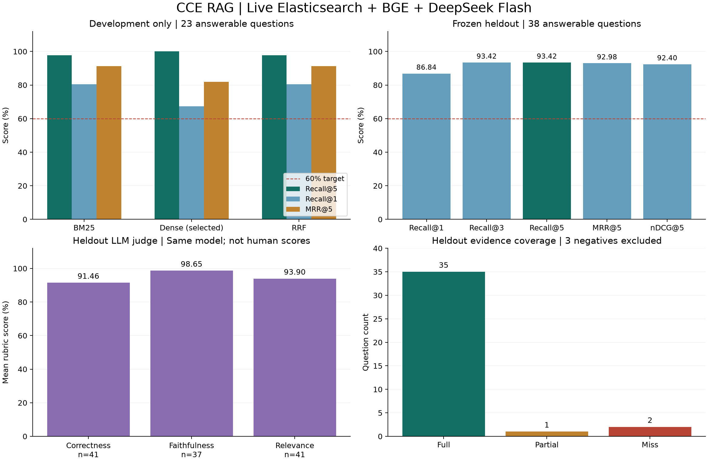

# 华为云 CCE 文档 RAG 统计报表

报告日期：2026-09-20（UTC+08:00）；原始请求时间保留UTC。运行模式：**LIVE**。

**固定独立验收集宏平均 Recall@5 = 93.42%，达到≥60%的目标。**开发集在BM25基线上分析bad case后选择Dense；开发集Recall@5从97.83%提升到100%。验收结果来自选型冻结后的另一组问题，两组分数不能当作前后提升量。

本次真实运行 Elasticsearch、本地 BGE 中文 embedding、Go + Eino HTTP 问答、官方 DeepSeek `deepseek-flash`，并向 Phoenix 写入数据集、实验、代码指标和模型评审。未使用REPLAY替代本表中的模型调用。

## 数据与固定实验条件

- 来源：[华为云 CCE《高危操作一览》](https://support.huaweicloud.com/usermanual-cce/cce_10_0054.html)；页面更新时间为2026-03-30 GMT+08:00，抓取时间为2026-09-19T18:31:19.160Z。
- 正常浏览器读取页面，展开表格合并单元格；8张表、55条证据行，加1个来源前言，共56个ES片段。每条保留分类、操作、后果、恢复方案及备注；不采集跳转页面。
- 66道Agent编写题：开发25题（23可回答、2负例），验收41题（38可回答、3负例）。按源证据组划分，同证据改写及比较题保持在同一组；所有源知识均可检索。
- 问题、参考答案、证据标签与分组在实验前冻结；配置在验收前冻结。本轮只使用开发集调参，验收后的错误分析留给下一版数据集与独立验收。
- 文档和片段存于Elasticsearch 9.5.4；业务状态仍使用真实本地文件存储。Go 1.26.8、Eino依赖及Python精确版本分别见go.mod和requirements.lock。
- embedding：`BAAI/bge-small-zh-v1.5`，512维，CLS + L2归一化，CPU两线程；固定revision `7999e1d3359715c523056ef9478215996d62a620`。
- 最终策略Dense，Top K固定5，每路候选20；比较策略RRF常数60。查询添加BGE中文检索指令，文档按原文编码；没有增加k或修改标签来达标。
- 生成和评审均为官方DeepSeek `deepseek-flash`，`thinking.type=disabled`。生成沿用项目证据引用提示，未增加特定题目的答案规则。
- 数据集SHA256：`c08c4b67938d20506a1e58aa278778ab65e907871ac95cb10bab41981ee2cc10`。
- 源表格SHA256：`b31b339bf36e783839857336dec4312abad573656e6cf201c05b966b7c7dab9a`。

## 检索统计

| 数据 / 策略 | 可回答题数 | Recall@1 | Recall@3 | Recall@5 | Precision@5 | Hit@5 | MRR@5 | nDCG@5 | HTTP p95 |
| --- | ---: | ---: | ---: | ---: | ---: | ---: | ---: | ---: | ---: |
| dev-bm25-baseline | 23 | 80.43% | 97.83% | 97.83% | 20.87% | 100.00% | 91.30% | 92.17% | 9.33 ms |
| dev-dense-v1 | 23 | 67.39% | 86.96% | 100.00% | 21.74% | 100.00% | 81.88% | 86.23% | 17.26 ms |
| dev-hybrid-v1 | 23 | 80.43% | 97.83% | 97.83% | 20.87% | 100.00% | 91.30% | 92.52% | 16.00 ms |
| heldout-dense-final | 38 | 86.84% | 93.42% | 93.42% | 20.53% | 94.74% | 92.98% | 92.40% | 12.14 ms |

验收集38道可回答题：35题证据全召回、1题只召回一半、2题完全漏召回。宏平均为`(35×1 + 1×0.5 + 2×0) / 38 = 93.42%`。负例不进入召回率分母。答案实验再次通过完整HTTP链路检索，得到相同的逐题Recall指标。

开发BM25已超过60%，继续迭代是为了补齐比较题cce-q060的第二项证据；Dense完成补齐，但Recall@1和MRR下降。按预定主指标选择Dense，没有宣称所有指标改善。等权RRF未补齐该遗漏，因此没有采用。详见[优化记录](optimization.md)。

开发Dense与RRF曾并行运行，时延不作严格性能优劣判断；最终验收单独运行。所有时延来自56片段的本机热服务，不代表生产吞吐。



## 真实生成与评审

| 指标 | 开发集 | 验收集 | 口径 |
| --- | ---: | ---: | --- |
| 处理成功率 | 100.00% | 100.00% | 全部25/41题；未FAILED不等于正确回答 |
| 返回ANSWERED比例 | 92.00% | 90.24% | 全部25/41题 |
| 引用原文完整性 | 100.00% | 100.00% | 有引用的23/37题；按题平均，HTTP回读哈希与发布状态 |
| 引用证据召回率 | 100.00% | 93.42% | 可回答23/38题；无引用记0 |
| 引用标签精确率 | 97.83% | 94.74% | 可回答23/38题；无引用记0 |
| 至少命中一项引用证据 | 100.00% | 94.74% | 可回答23/38题 |
| 无答案问题正确拒答率 | 100.00% | 100.00% | 开发2/2、验收3/3；样本很少 |
| LLM正确性均分 | 100.00%（n=25） | 91.46%（n=41） | 固定0/0.5/1 rubric |
| LLM忠实度均分 | 100.00%（n=23） | 98.65%（n=37） | 固定0/0.5/1 rubric |
| LLM相关性均分 | 100.00%（n=25） | 93.90%（n=41） | 固定0/0.5/1 rubric |

验收实际状态：37个ANSWERED、4个UNRESOLVED、0个FAILED；4个未解答中有3个预期负例及1个漏召回。LLM正确性分布为36题1分、3题0.5分、2题0分。忠实度仅对37个非空答案评分；空答案为null，不当作满分。

以上LLM指标是模型评审均分，**不是人工准确率或模型自报置信度**。生成与评审使用同一模型，可能有共同偏差。引用完整性100%只证明引用可打开且内容一致，不能证明语义结论正确。

| 延迟 | 开发真实问答（25题） | 验收真实问答（41题） |
| --- | ---: | ---: |
| mean | 910.50 ms | 875.28 ms |
| p50 | 896.48 ms | 816.28 ms |
| p95 | 1325.62 ms | 1153.41 ms |

问答延迟包含创建会话、提交问题及约100ms间隔的终态轮询；不含后续引用回读与LLM评审。检索延迟包含Go HTTP与ES/embedding调用。p95使用排序后`ceil(0.95×n)`位置。

## 逐题缺口与后续迭代

| 验收题 | 类别 | 源证据核对及影响 |
| --- | --- | --- |
| cce-q001 | 漏召回 | 检索漏召回：全量拉取列表未匹配 kube-apiserver/LIST；返回缺口，没有编造处理办法。 |
| cce-q053 | 相似操作混淆 | 实质错误：未召回直接操作EVS的r03，误用解除挂载/umount的r01、r02并声称有恢复方法；r03恢复栏为“无”。“无”仅表示本页未提供方法。 |
| cce-q057 | 比较题漏一半 | 比较题漏证据：缺控制节点IP的r07，仅召回Node节点r16，答案只回答一半且没有指出另一半缺口。 |
| cce-q048 | 题目/证据缺口 | 问法与证据缺口：问题问“为什么”，原文只列出重复采集的后果，未解释机制。保留0.5分，下一版应校准题目或显式说明机制未知。 |
| cce-q061 | 评审误判 | 可见评审误判：答案已分别写明两参数改回0，judge却称没回答建议值；保留原始0.5分，不据此改高统计分数。 |

开发题cce-q015额外引用了有依据的背景，引用标签精确率0.5但LLM评分为满分，说明精确率受标签覆盖范围影响。详细问题、参考答案、实际前五证据、原文、答案、评分解释和trace_id均在[bad case明细](badcases.md)及[JSON](badcases.json)。

本轮已按开发bad case完成BM25→Dense/RRF比较→Dense选型，并通过独立验收，停止继续调参。下一轮优先检验：对象和动作字段重排；比较题拆分查询并检查两侧覆盖；缺对应操作证据时拒答或明确部分回答；对“为什么”题补充有来源的机制资料或调整问题。这些是待验证假设，尚未作为本轮优化结果实现。应先建立新开发题和未查看的新验收集。

## 指标定义与统计边界

令`Gq`为问题的相关原文行集合，`Dq(k)`为前k个检索行ID，所有检索指标先逐题计算，再对可回答题宏平均。

- Recall@k = `|Gq ∩ Dq(k)| / |Gq|`；Precision@5 = `|Gq ∩ Dq(5)| / 5`。
- Hit@5 = 前五至少命中一行的题目比例；MRR@5 = 首个相关行排名的倒数，未命中为0。
- nDCG@5采用二元相关性：`DCG=Σ rel(i)/log2(i+1)`，除以前五理想排序的DCG。
- 每题仅1–2项相关行，固定返回5条；Precision@5即使全召回通常也只有20%–40%。它仍然反映上下文包含额外内容，不应隐藏，也不直接等同答案错误率。
- 引用召回/精确率以实际引用集合替代检索集合；原文完整性按每题引用的哈希和发布状态计算。
- LLM正确性对参考答案，忠实度对实际召回上下文，相关性对问题；不使用向量相似度或生成模型自评作为正确性的替代。
- 数据来自单一公开页面，题目由Agent编写，未经过运维专家独立认证；验收是问题分组隔离，不是新文档或新硬件域泛化测试。5个负例不足以证明生产拒答能力。
- 此实验不覆盖实时资产、内网设备、生产权限、PostgreSQL联调或容量验收；QA-03与QA-06的其他范围仍待实施。

## Phoenix与用量证据

Phoenix项目：`hwops-cce-rag`；本地地址：http://127.0.0.1:16006。已回读2个数据集、6个实验、182条实验run，导出607个span；248个实验/评审trace引用全部存在。

| 数据集 | 样本数 | Phoenix ID / 版本 |
| --- | ---: | --- |
| [development](http://127.0.0.1:16006/datasets/RGF0YXNldDox) | 25 | `RGF0YXNldDox` / `RGF0YXNldFZlcnNpb246MQ==` |
| [heldout](http://127.0.0.1:16006/datasets/RGF0YXNldDoy) | 41 | `RGF0YXNldDoy` / `RGF0YXNldFZlcnNpb246Mg==` |

| 实验 | run数 | Phoenix实验接口 |
| --- | ---: | --- |
| [dev-bm25-baseline](dev-bm25-baseline.json) | 25 | [RXhwZXJpbWVudDox](http://127.0.0.1:16006/v1/experiments/RXhwZXJpbWVudDox) |
| [dev-dense-answers](dev-dense-answers.json) | 25 | [RXhwZXJpbWVudDo0](http://127.0.0.1:16006/v1/experiments/RXhwZXJpbWVudDo0) |
| [dev-dense-v1](dev-dense-v1.json) | 25 | [RXhwZXJpbWVudDoy](http://127.0.0.1:16006/v1/experiments/RXhwZXJpbWVudDoy) |
| [dev-hybrid-v1](dev-hybrid-v1.json) | 25 | [RXhwZXJpbWVudDoz](http://127.0.0.1:16006/v1/experiments/RXhwZXJpbWVudDoz) |
| [heldout-dense-answers](heldout-dense-answers.json) | 41 | [RXhwZXJpbWVudDo2](http://127.0.0.1:16006/v1/experiments/RXhwZXJpbWVudDo2) |
| [heldout-dense-final](heldout-dense-final.json) | 41 | [RXhwZXJpbWVudDo1](http://127.0.0.1:16006/v1/experiments/RXhwZXJpbWVudDo1) |

Span类型：RETRIEVER=182、EMBEDDING=161、LLM=132、EVALUATOR=66、CHAIN=66。
66次生成和66次评审均有真实上游usage与trace。下表只统计这两组已完成的问答/评审实验，不推算额外连通性检查或账户总账单。

| 阶段（开发+验收） | 实际调用数 | 输入tokens | 输出tokens | 总tokens |
| --- | ---: | ---: | ---: | ---: |
| 生成 | 66 | 58,929 | 6,414 | 65,343 |
| LLM评审 | 66 | 93,141 | 4,785 | 97,926 |

用量是API返回值；没有假定价格或伪造费用。原始judge usage保留缓存命中字段。导出追踪和报告已扫描，未包含临时密钥。

## 工程验证、资源与复现

Go全量race测试通过，包含QA-01/QA-02回归、公开检索接口、真实ES与embedding流程；vet、构建与Python脚本运行检查通过。HTTP契约测试只模拟外部依赖；ES测试的生成器标记REPLAY，DeepSeek真实效果由上述独立实验验证。真实PostgreSQL测试因没有连接配置跳过。日志见[验证记录](validation/)。

资源释放状态：已全部停止并核验；临时DeepSeek密钥文件：已删除。Go、ES、Phoenix、embedding进程及子进程停止，相关端口已释放。Phoenix当前已关闭，以上本地链接需重启服务后访问。
停止前记录的进程树RSS合计为1946.0 MiB（瞬时RSS求和，非峰值或独占物理内存）；该进程集已释放。数据库、模型磁盘缓存和报表保留，便于复核。详见[清理记录](cleanup.json)。

启动、健康检查、复测与停止命令见[运行说明](../../scripts/rag/README.md)。仅查看Phoenix历史数据可执行：

```sh
PHOENIX_WORKING_DIR="$PWD/.local/rag/phoenix" PHOENIX_HOST=127.0.0.1 PHOENIX_PORT=16006 \
  .tools/rag-venv/bin/python scripts/rag/phoenix_local.py
```

该命令只打开Phoenix，查看后Ctrl+C退出。恢复整个实验使用`services.py start`，再次真实生成需通过环境重新提供密钥。离线重新生成报表只需`.tools/rag-venv/bin/python scripts/rag/report.py`，不会调用模型。

## 交付文件

- [汇总CSV](summary.csv)、[逐题CSV（182条）](per-query.csv)、[机器可读统计](summary.json)。
- [统计图PNG](metrics.png)、[矢量图SVG](metrics.svg)、[bad case明细](badcases.md)。
- [Phoenix spans JSON](phoenix-spans.json)、[CSV](phoenix-spans.csv)、[接口回读核验](verification.json)。
- [冻结配置](selection.json)、[原文修订](published-revision.json)、[ES文档导出](elasticsearch-documents.json)。
- [源数据与冻结题库](../../testdata/rag/cce/)、[代码与评测复现](../../scripts/rag/README.md)。
